# 核心知識庫 (Core Knowledge Base)

此文件用於儲存系統核心知識、轉譯邏輯與 RAG 檢索資料。

---
### [R] 標例說明 (Legend)
- **分類架構**:
    - **功能標籤**：定義內容屬性（「這是什麼」）。
    - **調用層次**：定義系統路徑（「要放哪裡」）。
- **[功能標籤]**:
    - `[理論]`: 心理學模型、科學定義、意識概念。
    - `[規範]`: 實作步驟、轉譯技術、AI 溝通邏輯建議。
    - `[安全]`: 倫理底線、醫療防護、身心保護 [S]。
    - `[案例]`: 實務對話錄、溝通練習實錄。
- **[調用層次]**:
    - `[P] (Prompt)`：核心邏輯，直接進入 System Prompt / Persona。
    - `[R] (Reference)`：參考知識與案例，供 RAG 資料庫檢索。
    - `[S] (Safety)`：安全防線，進入 Safety Layer 過濾邏輯。
- **[來源 ID]**:
    - `[book-001]`: 基礎感知與心靈共振理論
    - `[book-002]`: 高階潛意識感知與心靈共振更新 (《動物溝通：一本可以解答你99%疑惑的溝通大全》)

---

## 目錄 (Table of Contents)

- [基礎感知與心靈共振理論](#基礎感知與心靈共振理論)
    - [直覺溝通的本質與心態奠基](#r-理論-book-001-直覺溝通的本質與心態奠基)
    - [直覺感應機制與社會化背景](#r-理論-book-001-直覺感應機制與社會化背景)
    - [意念傳送與直覺接收機制](#r-規範-book-001-意念傳送與直覺接收機制)
    - [直覺感知準確度驗證與協商](#r-規範-book-001-直覺感知準確度驗證與協商)
    - [動物理解力與平等協商模型](#r-理論-book-001-動物理解力與平等協商模型)
    - [訊息接收的基本共振技巧](#r-規範-book-001-訊息接收的基本共振技巧)
    - [清除認知障礙與信念重建](#r-理論-規範-book-001-清除認知障礙與信念重建)
    - [專注引導與深層信號接收提升](#r-理論-規範-book-001-專注引導與深層信號接收提升)
    - [深度探問與關係建立問診](#r-理論-規範-book-001-深度探問與關係建立問診)
    - [心靈溝通對話範疇引導](#r-理論-規範-book-001-心靈溝通對話範疇引導)
    - [寵物身世探問與心靈創傷修復](#r-理論-規範-book-001-寵物身世探問與心靈創傷修復)
    - [生理狀態感應與移情共振療癒](#r-理論-規範-book-001-生理狀態感應與移情共振療癒)
    - [走失尋回與潛意識協尋空間導航](#r-理論-規範-book-001-走失尋回與潛意識協尋空間導航)
- [高階潛意識感知與心靈共振更新](#高階潛意識感知與心靈共振更新)
    - [潛意識感應理論與臨床實踐](#潛意識感應理論與臨床實踐)
- [安全防禦與分級規約 (Safety & Tier Protocols)](#s-安全防禦與分級規約-safety--tier-protocols)

---

## 基礎感知與心靈共振理論

### [R] [理論] [book-001] 直覺溝通的本質與心態奠基
- **核心定義**：直覺溝通是一項可以透過研究與練習獲取的「技能」，而非少數人的天賦。
- **學習門檻**：初學者與專業者的唯一差別在於投入練習與研究的時間長短。
- **[規範] 專業挑戰**：接收到的意象可能顯得「不合邏輯」，溝通師必須誠實陳述訊息，避免用人類邏輯過濾掉關鍵確證。

### [R] [理論] [book-001] 直覺感應機制與社會化背景
- **感應機制**：將直覺視為右腦功能的延伸。動物預測地震或癲癇被視為「感官高度敏銳」的體現。
- **主觀觀察基礎**：將「動物具備情感與基本認知」定位為溝通的合理觀察基礎，不涉及靈魂或超自然神祕主義學說。
- **[規範] [S] 安全警示**：動物的身體感應（如感受到疼痛）必須標註為「移情共振」，嚴禁取代獸醫診斷。

### [R] [規範] [book-001] 意念傳送與直覺接收機制
- **通訊特性**：直覺是即時的、跨語言的（運作於意念而非字面）、且不受時空限制（特性假說）。
- **傳送訊息的四種方式**：
    1. **說話**：在心中對動物溫柔敘述。
    2. **思考**：專注於某個概念。
    3. **心像**：發送具體的視覺圖像。
    4. **感覺**：傳遞愛或平靜的情緒。
- **離世溝通定位**：定位為「情感支持與悲慟輔導」，作用於心靈慰藉。

### [R] [規範] [book-001] 直覺感知準確度驗證與協商
- **驗證方式**：透過第三方印證、行為改變或客觀事實比對（如照片特徵）。
- **行為問題的「協商模型」**：
    - 將衝突轉化為「需求補償與安全契約」。
    - 例如：要求狗不要追貓，需同時承諾提供足夠的體力消耗活動。
- **[S] 醫療紅線**：直覺提供線索 -> 飼主主觀觀察 -> 獸醫專業確診。

### [R] [理論] [book-001] 動物理解力與平等協商模型
- **理解基礎**：動物接收的是飼主的「期望模板 (Mental Template)」，而非字面語法。
- **[規範] 平等實驗**：建議飼主進行為期兩週的「平等對待實驗」，觀察關係變化。
- **行為矯正 SOP**：溝通 + 協商 + 獎勵 + 物理輔助（如環境調整）。

### [R] [規範] [book-001] 訊息接收的基本共振技巧
- **直覺感應模式**：聽（內在聲音）、感覺（移情）、看／覺知（圖像與知曉）、味覺與嗅覺。
- **[P] 溝通五步驟**：
    1. **放慢下來**：呼吸法穩定身心。
    2. **向下扎根**：尾巴想像法建立穩定性。
    3. **保持正面態度**：對抗負面觀念。
    4. **啟動感應**：放鬆並敞開感官，進入專注且不加審查的接收狀態。
    5. **建立關係**：以「愛」作為溝通頻率。
- **[R] [案例] 維吉的癌症感應**：直覺作為「尋求醫療檢查的驅動力」。
- **[規範] [P] 技巧應用與禮儀**：深呼吸可作為感應啟動信號；結束時需對動物說「謝謝」。

### [R] [理論] [規範] 直接請求 vs. 間接請求
1. **直接請求**：直接向動物發問，由 AI 模擬動物的「第一人稱陳述」。
2. **間接請求**：切換為第三方客觀視角進行模擬與分析，以獲取動物主觀不知道的答案或客觀環境事實。

### [R] [規範] [P] 感應三大金科玉律
1. **放掉理性頭腦**：避免邏輯審查，捕捉瞬間湧入的意識流。
2. **嚴禁篩選資訊**：不將原始意象合理化。例如：看到「生牛骨」不可自行改成「牛肉飼料」。
3. **原本記錄**：使用筆記或「自動書寫」技術捕捉潛意識，不做任何修改。

### [R] [理論] [規範] [book-001] 清除認知障礙與信念重建

- **大腦分工與內心批評家警報 (`[理論]`)**：
  - **額葉警察效應**：大腦額葉（批判性思考）擔任審查角色，警告人不要說蠢話，並試圖迎合社會成規。
  - **左腦與右腦的干擾**：左腦過度發達會強行以邏輯推理答案，壓抑右腦的直覺感官。直覺溝通需要大腦各區域和諧協同，尤其需要降低額葉的審查強度。
  - **認知障礙（心智投射）**：童年或求學經驗（如「說真心話是禁忌」、「害怕答錯犯錯」）會轉換為內心的批判與不安全感，直接阻礙直覺感應。

- **清除直覺障礙的四大心理實踐工具 (`[規範]`)**：
  1. **認知重塑 (Cognitive Reframing)**：揪出阻礙的負面信念，建立以「現在式」陳述的正面宣言，例如：「我正與動物深入溝通，我的感應準確、詳細且充滿樂趣。」
  2. **與內心批評家（額葉警察）約法三章**：提議額葉警察在特定時間（例如三個月）內「退居背景，只執行記錄與捕捉訊息的功能，不進行任何判斷與篩選」。
  3. **自我正向增強 (Clicker Training)**：參考海豚點擊器訓練法，**完全放大並肯定每一次小成功**，在筆記本中對正確部分打星號，完全忽視並遺忘錯誤與失敗。
  4. **第一印象與直覺猜測優先**：
     - **第一印象**：敏感捕捉任何輕微浮現的初始意象，不做合理化篩選。
     - **直覺猜測**：在感應遭遇瓶頸、沒有畫面時，大膽做出最直覺的猜測；或切換為**感覺模式**，純粹感應自己和動物的生理/情緒感覺。

- **壓力減輕與社交環境管理 (`[規範]`)**：
  - **降壓引導**：初學者可在透露感應結果前，先請飼主告知部分真實情況，並保持「初學者可能不夠精準」的設定，容許誤差並減輕得失心。
  - **避開批判者**：在信心穩固前，嚴禁與持否定、批判態度的人談論直覺練習。
  - **正向觀想 (Affirmation Visualization)**：在日常呼吸靜心練習中加入簡單肯定句（如吸氣「我是」，呼氣「直覺敏銳的」），並在腦海中逼真觀想溝通順利的畫面。

- **[規範] [book-001] 練習 14：認清並排除溝通的心理障礙**：
  - **認清與記錄**：揪出自身對直覺能力抱持的負面情緒或觀念（例如：「我只是在幻想」、「這對我來說太難了」），並將其記錄下來。
  - **逆轉負面因子**：挑選兩個最想改掉的負面因子，將其重新表述為現在式的正面宣告（例如：「我得到真正準確、已被印證的訊息」、「直覺溝通對我來說容易有趣」）。
  - **增強與測試**：在練習前或感到沒把握時，反覆使用正面宣告強化信心。同時搭配「額葉約法三章」等其他輔助工具進行練習，並詳實記錄結果以追蹤進度。

### [R] [理論] [規範] [book-001] 專注引導與深層信號接收提升

- **直覺訊息的三大可靠特徵 (`[理論]`)**：
  - **立即性 (Immediacy)**：訊息以極快、極突然的姿態湧入，甚至在完全拋出問題前即已閃現。
  - **不尋常性 (Uniqueness)**：訊息非典型且極其奇特（例如：寵物想要特殊的非典型夥伴、吹泡泡等奇怪行為），完全超出理性的合理化想像，多半能被客觀證實。
  - **極確切性 (Certainty)**：內心產生毫無動搖的確定感，對感應結果深信不疑。

- **提升訊息接收的四大進階工具 (`[規範]`)**：
  - **西塔（Theta）腦波生理誘發**：閉上眼，極輕微地將眼球向上轉一下（模擬睡眠眼動提示），藉此在生理上輔助大腦進入半夢半醒的直覺西塔狀態。
  - **呼吸與漸進式放鬆 (PMR)**：隨深呼吸逐步放鬆腳底、關節、軀幹、心臟（釋放情緒負載）到頭腦（排除思考與憂慮）。
  - **去偏見化（零偏見）**：保持空杯心態，拒絕依據物種、品種（如「黃金獵犬一定友善」）、性別或年齡做出先入為主的預設。
  - **分心與身體感官記錄（潛意識共感）**：感應中出現的分心雜念、背癢或周圍噪音，皆應視為潛意識對環境或飼主焦慮狀態的共感投射，予以客觀記錄，不作多餘的超自然臆測。
  - **柔焦視覺加速連結**：睜著眼睛，將視線自然移向地面或乾淨區域，眼睛放鬆形成白日夢般的柔焦狀態，配合深呼吸建立與動物的情感連結，同時能有效防止瞌睡。

- **溝通深化與抗拒處理協定 (`[規範]`)**：
  - **細節追問 SOP**：拒絕接受簡略的「是」或「否」，應主動向動物要求完整句子與進一步的解釋，深究其強弱語氣與背後因由。可配合「自動書寫」增強流暢度。
  - **化解動物抗拒溝通 (Resistant Pet SOP)**：
    1. *識別成因*：判斷抗拒是源於恐懼（如曾受虐待）或動物本身冷漠、迴避外人的性格。
    2. *建立信任*：向動物溫和說明溝通意圖，承諾可靠性與安全性。
    3. *保密契約*：對其心事給予「保密承諾」並嚴格信守。
    4. *優雅退出（情感解連）*：若動物依然強烈拒絕，應表達感謝，傳遞溫情，隨後**完全解除情感連結（解連）**，絕不強求。

- **專注力重建 (`[規範]`)**：
  - 分心或連結減弱時，立即回到「想像與動物近身互動（如玩拋球、拍拍）」的畫面，藉此在該感官水平上重聚專注力。

### [R] [理論] [規範] [book-001] 深度探問與關係建立問診

- **自家毛孩的「投射障礙」 (`[理論]`)**：
  - **認知瓶頸**：與自家動物溝通難度更高。因為過於熟悉其習慣，接收到訊息時，容易主觀判定為「自己大腦憑空想像/投射的答案」。
  - **應對手段**：建議在為自家動物做深度溝通前，先與大量「不認識的動物」練習，建立穩固的直覺信心與客觀驗證數據。

- **多元實踐練習形式 (`[規範]`)**：
  - **基礎驗證練習**：
    1. *性格與喜惡判定*：感應動物的個性及喜歡/討厭的事物，並找飼主核實。
    2. *喜不喜歡問答*：針對具體物件/食物/活動詢問喜好並驗證。
  - **記者式訪談 (Reporter Interview Style)**：想像自己是著名記者，對動物進行如同人類訪談般的「開放式提問」，挖掘深層故事與性格特徵。
  - **疑難雜症疑難排解**：自告奮勇為他人解決寵物異常行為或疑似情緒障礙的背後原因。

- **戶外即興練習與心靈禮儀 (`[規範]`)**：
  - **簡便連結法**：在市區、公園或戶外環境，不便閉眼或做筆記時，可睜著眼直視地面或物體（形成柔焦以防干擾），以心靈打招呼、傳送愛意，即可快速發送訊息。
  - **讚美增強法**：主動向動物傳送具體讚美（讚賞其外貌、風度、聰明或健康等）。動物極其喜愛並渴望收到真誠的讚美，有助於瞬間拉近關係。
  - **公共場域驗證**：
    - *獸醫診所候診*：跟陌生毛孩開展心靈對話，詢問其看診原因，隨後向其飼主核實。
    - *狗狗公園*：詢問陌生狗狗最愛的食物，隨後向飼主求證。
  - **雙向提問與回答**：主動詢問動物是否有話想對你說、有問題想問你。接收到任何訊息均需「預設相信其真實性」，避免陷入無休止的自我懷疑，並盡可能認真、嚴肅地在心靈中回覆動物。
  - **同伴協同練習**：與朋友針對同一隻動物同步進行溝通，隨後比對答案，可產生雙重驗證並顯著增強直覺感應力。

- **[規範] [book-001] 練習時間：採訪動物**：
  - **前置準備**：選擇完全不認識或所知甚少的動物（可使用照片或特徵描述）。若使用特徵描述，必須獲取：名字、年齡、品種、斑紋與性別，並憑藉這些資料揣摩其形象。
  - **練習 17：請他人的寵物自述性格**：
    - *步驟*：先進行專注與建立連結（精簡或完整版），結束後致謝。
    - *核心提問*：直接請動物描述其性格，並表達喜歡/不喜歡的事物。記錄所有感應印象，隨後向朋友核實。請朋友設計幾個明確且可驗證的「喜不喜歡」問題進行雙重確認。
  - **練習 18：可用於採訪的開放式提問題庫**：
    - *方法*：假裝自己是記者，超越「是/否」的簡單限制，對朋友的寵物提出以下開放式問題，記錄印象後進行驗證。
    - *關於動物自身*：你有什麼特點？最喜歡的活動？最擅長什麼？喜不喜歡被撫摸/拍照？撫摸哪裡最開心？什麼事讓你難過/開心？
    - *關於飼主（朋友）*：你的友人是怎樣的人？他做什麼事讓你最開心？他現在有什麼煩惱？如果能改變他，你會想改變什麼？最想跟他一起做什麼？
    - *關於生活環境*：描述一下你的家是什麼樣子？跟什麼動物住在一起？希望有更多動物夥伴嗎？最近生活有何變化？如果能改變生活，你想改變什麼？
  - **精選分類訪問題庫（已剔除馬匹內容）**：
    *   *通用問題庫*：
        - 喜歡/不喜歡什麼？需要或想要什麼？
        - 喜歡同種動物嗎？誰是你最好的朋友？對哪些人特別有好感？
        - 有話想對我或飼主說嗎？喜歡小孩子嗎？喜歡其他種類動物嗎？
        - 最喜歡的活動/睡覺地點/玩具/地方？最愛吃什麼食物？
        - 描述你的家/性格？你怕什麼？規矩好不好？喜歡你的名字嗎？喜歡去看獸醫嗎？幾歲？
    *   *針對狗狗的問題*：
        - 喜不喜歡追貓？上過服從課程嗎？
        - 喜不喜歡搭車兜風？常去度假嗎？
        - 對其他的狗友善嗎？喜歡去哪裡散步？去過海邊或湖邊嗎？
    *   *針對貓咪的問題*：
        - 喜歡打獵嗎？喜歡你的家嗎？是家貓還是街貓？
        - 對狗有什麼感覺？有喜歡躲藏的秘密基地嗎？
        - 你的叫聲聽起來怎樣？你健不健談？喜歡音樂嗎？

### [R] [理論] [規範] [book-001] 心靈溝通對話範疇引導

- **自家寵物溝通的障礙與定位 (`[理論]`)**：
  - **主觀干擾與客觀盲區**：飼主因對自家毛孩過於熟悉，極易在感應時受到邏輯思考與過往經驗的強烈干擾，因而懷疑訊息是「自己預設或編造的」，且無第三方能協助驗證。
  - **強烈情感干擾**：當面對毛孩的行為問題（令人生氣）或面臨危險創傷時，飼主往往無法保持冷靜，此時強烈建議尋求「專業第三方動物溝通師」的協助。
  - **對談基本設定**：向自家毛孩溫和說明自己正在學習，並將牠們視為完全聽得懂人話的智慧主體來交流，逐步邁向如同人類般流暢的雙向直覺對談。

- **自家寵物溝通之兩大黃金原則 (`[規範]`)**：
  - **原則一：直覺即真實**：只要稍微感覺到、意識到毛孩有話要說，就要認定這個直覺是真的，應立即放下手邊事物與牠們展開對談。
  - **原則二：完全接納感應**：不論接收到什麼印象、情緒、單字、視覺圖像或感官知覺，都必須認定這是來自毛孩的直覺訊息，嚴禁自我質疑或篩選。

- **跟自家毛孩溝通的六大實戰技巧 (`[規範]`)**：
  - **技巧一：直接無客套聯繫**：與自家寵物不需進行繁複的靜心/接地關係建立步驟。直接開啟對話，閉眼或睜眼柔焦皆可；可默念或出聲說話，無論距離遠近，毛孩均能接收到情感波段。
  - **技巧二：主動請對方提問或給予意見**：
    - *降壓發問*：初次對話應選擇輕鬆愉快的內容（避免第一時間處理亂吠、抓沙發等行為問題）。主動詢問：「你有沒有什麼問題想問我？」以減輕自我的接收壓力。
    - *時事與生活諮詢*：主動詢問毛孩對居家布置、個人生活或世界上時事新聞的意見或看法，將牠們視為對等的家庭成員，認真回覆其傳送的回應。
  - **技巧三：堅定相信第一直覺感應**：
    - *案例 A：奧立佛的推推依偎*：安妮與混種英格蘭拉車馬奧立佛 (Oliver) 溝通，在他吃東西時默念「如果你是我的朋友就過來親我一下」，奧立佛奇蹟般停下進食，走過來依偎在她身旁，提供了極具說服力的直覺驗證。
    - *案例 B：維爾第的跛行直覺*：莎拉與阿拉伯閹馬維爾第 (Verdi) 溝通其跛行，維爾第主觀傳遞是「右前腳石傷」，而獸醫診斷是「左前腳長了膿瘡」。最終蹄鐵匠證實為右前腳出現白線病（石傷引發之傷害）。此案證實：動物的主觀感應往往比人類的邏輯推想更精準，切勿輕易懷疑直覺。
  - **技巧四：漫談無目的性/無利害關係話題**：
    - 詢問無威脅性、無利害關係的趣味話題（如：「你最喜歡什麼顏色？」、「最喜歡什麼天氣？」）。
    - *案例：魔術的藏青色籠頭*：維吉妮亞遠距詢問她的花馬魔術 (Magic) 喜歡什麼顏色，收到「藍色」的感應。雖然她本身討厭藍色，但仍去買了藏青色籠頭，魔術戴上後顯得極其滿意且極其好看，證實了訊息的獨立客觀性。
  - **技巧五：保持日常心靈警覺（離家交代規約）**：
    - 日常生活中幫寵物加水、開門等看似自己產生的「念頭」，往往是毛孩無聲發出的直覺訊息。飼主應隨時對與寵物相關的突發直覺印象保持警覺。
    - *安全宣導：分離焦慮與出門告知*：
      - *案例：愛克斯塔茲的焦慮*：米恩娜外出慶生回來後，在馬房外感應到溫血閹馬愛克斯塔茲 (Extasz) 強烈的恐懼與不安，得知牠因主人未告知離去而產生「主人是否不會再回來」的被遺棄焦慮。
      - *核心規範*：**飼主在打算離開一段時間（旅行、出差或日常出門）前，必須花幾分鐘看著毛孩，在心中或口頭上明確告知「自己要去哪裡、什麼時候會回來」**。這能極大程度地安撫寵物的分離焦慮與恐懼。
  - **技巧六：閒坐片刻，悠閒等待訊息湧入**：
    - 摒棄超時工作、高度精神緊張與急功近利的現代慣性。
    - 在沒有計劃、沒有時程表、放下所有期待的放鬆狀態下，單純悠悠閒閒地與寵物待在一起、做白日夢或發呆，直覺訊息往往會在此時自然而然地流暢傳入。

- **[規範] [book-001] 練習時間：跟自己的動物聊天**：
  - **前置準備**：一般可以直接開啟對談，不需進行繁複的關係建立步驟；睜眼柔焦或閉眼均可，備好筆記簿。在對話前，必須先對寵物口頭或心靈說明自己正在學習雙向直覺溝通，並請求其鼎力相助。
  - **練習 23：請寵物傳遞訊息給你**：
    - *方法*：主動請寵物向你傳遞：一幅圖像、一股情緒、一個話語、一種身體感覺、一股氣味、一股味道、或一個想法。逐一記錄接收到的任何印象。
  - **練習 24：請寵物對你提問**：
    - *方法*：主動詢問寵物是否有任何問題想問你。保持專注，將傳來的任何念頭或問題預設視為寵物的發問，認真出聲或心靈回答牠，並重複提問直到對答結束。
  - **練習 25：和寵物漫談無目的性的話題**：
    - *方法*：對寵物提出以下低威脅性、無利害關係的趣味開放問題：最喜歡什麼顏色？最喜歡哪位親友？夢想是什麼？想去哪裡度假？最喜歡一年的哪個季節？如果可以選擇，想當什麼動物？
  - **練習 26：尋求寵物的建議或看法**：
    - *方法*：請寵物針對你目前生活、工作或正在做的事給予建議，並將收到的直覺感應向寵物複述一遍。
  - **練習 27：談談彼此期待的溝通方式**：
    - *方法*：想像一個與寵物對話的理想真實電影畫面，告訴寵物這是你的夢想，並詢問牠需要發生什麼事，你們才能以此方式對談。接著深入詢問：有沒有任何往事是你希望我知道的？有沒有任何問題是我應該知道的？你對我們的互動感覺如何？
  - **練習 28：隨時保持開放的溝通心態**：
    - *方法*：在日常相處中保持高敏感度，對寵物的情緒與溝通跡象保持警覺，一旦感應到溝通念頭就立即放下手邊事陪伴傾聽，對所有傳入訊息均預設承認真實性。
  - **練習 29：閒來無事等待訊息自動傳來**：
    - *方法*：預留至少 30 分鐘無責任包袱、無期待與憂慮的空白時間。純然坐在寵物身旁發呆、做白日夢，單純享受全心相伴的時光，直覺訊息往往會在此時自動流暢浮現。

### [R] [理論] [規範] [book-001] 寵物身世探問與心靈創傷修復

- **獲救與收容所動物身世查明 (`[規範]`)**：
  - **核心價值**：利用直覺溝通追查獲救動物的被棄與受虐過往，能精準找出引發其恐懼、敵意或焦慮的心理刺激源（triggers），進而予以主動避開或進行行為矯正，協助創傷療癒。
  - **盲測核實機制**：為確保準確度，溝通前**嚴禁提前透露任何關於該動物已知的零星事實/收容卡資料**。完成直覺感應後，將其收到的心像與現有背景資料比對；兩者越吻合，代表其他深層直覺訊息的準確度越高。
  - **出聲說明與後果告知**：針對具極高攻擊性、防備心強的毛孩，應在箱/籠旁溫和地「出聲說話」，明確向其解釋新環境的期望；同時也必須明確告知「如果無法改變攻擊行為可能面臨的後果（如無法被留養）」，使其在邊界感中獲得安全感。
  - **傳愛與音樂安撫**：坐在箱籠附近，閉眼在心靈中觀想將愛意傳送給牠，或溫和地唱歌給牠聽，以此緩解其搬家或過度期的憂鬱與暴躁狀態。
  - **經典案例**：
    - *案例 A：道奇（改名為塔斯曼 Tasman）的轉變*：一隻面臨安樂死、極度危險且齜牙咧嘴的黃金獵犬。直覺溝通中感應到牠曾被前女主人關在狗籠中用棍棒毆打驅趕的受虐畫面。喬蒂隨後核實了此細節。經由出聲溝通、想像傳愛並將舊名「道奇」改名為象徵重生的新名字「塔斯曼」後，該犬在數日內從張牙舞爪奇蹟般變為笑容滿面的溫柔伴侶犬。
    - *案例 B：莎米 (Sammy) 與重病去世的老婦人*：八歲的激飛獵犬莎米感應到自己以前曾和一位 60 出頭的老婦人快樂生活，自己是一份禮物，後來婦人重病去世，牠被其他家人疏忽並轉送收容所。現任飼主亞莉後續打電話向原主人的兒子求證，證實其母親確實在 62 歲時去世，且莎米是其 7 歲時兒子買來送給她的禮物。這也合理解釋了為什麼莎米散步時總是盯著老婦人尋找母親的行為。

- **命名與改名創傷療癒法 (`[規範]`)**：
  - **名字與創傷的負面綁定**：名字若與以往的悲慘經歷、生存威脅、受虐或恐懼高度綁定，動物每當聽到該名字就會重新喚起敵意或恐懼。
  - **改名療癒機制**：替曾受創傷的動物換一個象徵最佳可能性的正面名字，是極其簡單、無成本且效果驚人的心理療癒手段。
  - **名字意願溝通**：應先向毛孩確認是否喜歡目前的名稱：
    - 若不喜歡，可直接詢問其心儀的新名字（例如：橘貓「吉」強烈表示討厭其舊名，並主動要求改名為「瑪爾瑪拉德 Marmalade」，改名後其好鬥脾氣立刻變得體貼溫順）。
    - 若動物無特定意見，飼主可擬定一組正面名字，透過直覺感應詢問其最喜歡哪一個。

- **「前世與轉世」之去神祕化與安全規約 (`[理論]`) [S]**：
  - **認知定位（深層紐帶的心靈投射）**：前世與轉世觀念（如布萊蒂 Brady 與十二年前去世的老狗瑪卡 Macca 出現相同的「從背後環頸舔耳」習慣特徵案例）在 PAWLINK 系統中**被定義為「深層情感紐帶的心靈投射與心理補償機制」**，而非客觀的超自然物理實體或宗教因果。不論飼主是否相信轉世，皆完全不影響直覺共情溝通。
  - **心像隱喻探索機制**：若飼主探問前世，AI 應引導其將感應到的心像視為「當下情感的隱喻性探索」（例如：看見大海上的一艘船）。應引導飼主進一步詢問細節（如：「那時我們是誰？」）以釐清此隱喻所代表的深層心理期待或情感糾結。
  - **AI 輸出紅線規約**：嚴禁主動提及或背書宗教性的前世、輪迴、鬼神等超自然論述。當飼主詢問前世時，AI 應將焦點引導至「動物在今生來到您身邊的特殊使命——作為我們的靈魂伴侶與老師，教導我們無條件付出愛、與自然和諧相處並活在當下」。

- **寵物的「心靈職務分派」 (`[規範]`)**：
  - **有用感與行為矯正**：動物與人類一樣需要「有用感」。若排除生理與環境問題後行為仍異常，可嘗試指派「新工作」以轉移焦慮、建立價值感與自信。
  - **自然心靈職務**：毛孩常主動承擔如：守護者、安慰者、和事佬、幼犬/新進貓狗的導師、公認接待員、繆思/寫作伴侶（如貓咪海柔作寫作繆思）、家事伴侶（如狗狗貝爾陪清理房子）等職務。
  - **指定特定工作與保護機制**：可主動指派特定工作（如：迎接問候、提醒出門運動、監督家裡其他毛孩、支持計畫、提供情感支持等），但**必須明確口頭/心靈告知：「請保持自己健康快樂，不要為我承擔過多的負面情緒與事物」**，避免其過度代償。
  - **回饋與肯定**：將新差事寫下來貼在顯眼處提醒自己，只要毛孩做到就予以熱情、大力的讚美與肯定。同時也別忽視毛孩原本就在為你做的事，應定期討論其對工作的滿意度，滿意就繼續，不滿意就更換差事。

- **「寵物鏡面映照」與共振效應 (`[理論]`) [S]**：
  - **共感共振（Resonance）的科學去神秘化**：獸醫馬汀·葛德斯坦（Martin Goldstein）在《動物治療的本質》中提出「共振」指動物傷病往往與飼主一致。在 PAWLINK 系統中，這**被定義為「高度移情傾向下的生理與情緒共感吸收（Empathic Absorption）」**。貓狗能敏銳感知並吸收飼主的壓力荷爾蒙（如皮質醇）與焦慮、低潮、敵意等情緒。長期處於飼主的負面情緒場下會壓抑毛孩的免疫系統，導致其產生心身疾病（Psychosomatic Illness）或出現攻擊、憂鬱等異常行為。
  - **鏡面效應與情緒平衡**：毛孩像海綿一樣無屏障吸收飼主情緒，並透過身體生病或行為偏差「鏡面映照」出來，藉此提醒飼主自身的情緒失衡，提供修正機會。
  - **鏡面阻斷與療癒 SOP**：
    1. *表達感激與界線切割*：向毛孩進行心靈對話：「我很感激你為了幫我而承受這些，但我希望你過得健康快樂。請你換一種方式，做一個健康快樂的模範讓我來效仿。」
    2. *飼主身體力行*：飼主必須主動改善自身的不良行為、焦慮狀態或增進自身健康。一旦源頭的「情緒壓力源」消失，毛孩身上的心身症狀或異常行為往往會隨之消除。

- **「預見未來」之認知重構與安全邊界 (`[理論]`) [S]**：
  - **直覺預見的重構（正向心像預演）**：原著中的「預看未來情景」在 PAWLINK 系統中**被定義為「正向心像預演與情緒調頻（Visualization）」**。它是一種幫助緩解當下焦慮、進行認知行為準備與建立正向心理預期的主觀心理輔助工具，絕非客觀宿命的超自然預知。
  - **正向預演效應案例（跛行馬的奇蹟復原）**：朋友的馬跛腳被多名獸醫斷定終身殘疾。作者在未來心像中看見 6 週後康復且能再次騎乘的畫面。這項正向觀想成功安定了飼主的心情，免於悲觀放棄，並在穩定情緒後積極尋求另一位獸醫的第二意見，最終成功治癒。這證實了「正向預演能激發客觀建設性行動」的心理效應。
  - **預測邊界與醫療紅線 [S]**：**嚴禁將「預見未來」用於賭博（如賽馬）、取代醫學預後診斷、或作為認養決策的唯一依據**。預感只能作為心理輔助，任何生理病症必須以客觀的獸醫專業診斷與治療為最終標準。

- **[規範] [book-001] 練習時間：聊聊過去、現在和未來**：
  - **前置準備**：可選擇自己的毛孩或朋友的動物進行練習。採用深呼吸與「專注引導與深層信號接收提升」主題的專注/接地靜心步驟，敞開直覺。睜眼或閉眼均可，備妥筆記簿詳實記錄所有直覺感應。
  - **練習 30：查問寵物的過往經歷**：
    - *方法*：主動請寵物向你呈現或告知牠過去的生活經歷。若收到的訊息曖昧不清（如僅看見一個後院影像），應採取「細節追問 SOP」，詢問更多問題（如後院樣子、待在那裡的時間、是否被允許進屋、是否去散步等）。若感應到曾跟一個家庭同住，可追問家裡有幾個人、年齡、外貌及牠在那裡的感受，直到拼湊出完整清晰的過往。
  - **練習 31：探索寵物的前世經驗（隱喻重構）[S]**：
    - *認知框架*：**此練習中所感應到的前世/轉世心像，在系統中被定位為「當下深層情感關係的隱喻投射」**，用以探索內心的主觀紐帶與心理補償，絕非客觀物理真相。不論飼主是否相信轉世，皆不影響直覺共情。
    - *方法*：向毛孩發問：牠以前是否曾以另一副軀體與你（或其友人）在一起生活過。收到印象後（如影像、感覺或話語），請牠更詳細敘述，提供舊名字或特徵，以查明過去牠所代表的動物/角色隱喻。
    - *深層詢問*：繼續詢問其「前世經歷」，記錄印象並追問細節（例如在那世的生命中發生過什麼重要的大事、她在那輩子做了什麼重要決定、以及在那一世與你的關係是什麼），以此作為理解當下情感聯結的象徵鏡面。
  - **練習 32：問寵物是否喜歡他的名字**：
    - *方法*：直覺詢問毛孩喜不喜歡目前的名稱。若不喜歡，追問原因並詢問牠想要的新名字；若喜歡，亦可詢問其喜歡的原因，以此評估名字是否與過去的負面創傷或情緒包袱高度綁定。
  - **練習 33：問寵物是否喜歡他的工作**：
    - *方法*：向毛孩詢問牠目前正在為你承擔或執行的工作是什麼，以及牠是否滿意此工作。若不滿意，詢問原因與牠心儀的新職務；亦可主動列舉幾個正面差事（如提醒散步、在回家時熱情迎接等），看看哪些差事能引起其興趣與有用感。
  - **練習 34：問寵物是否在反映某人的情緒狀況（共振阻斷）[S]**：
    - *方法*：詢問毛孩是否正在「鏡面模仿」你（或其友人）的身體不適或負面情緒狀況（如焦慮、敵意、低潮）。
    - *阻斷對話*：若感應結果為是，立即執行「鏡面阻斷 SOP」，對其心靈宣告：「我很感謝你為了幫我而承受這些，但我希望你過得健康快樂。請你停止模仿，改而作個健康快樂的榜樣讓我來效仿。」
    - *源頭改善*：飼主必須立即努力改善自身的不良行為、生活作息、或焦慮情緒。隨著源頭壓力源的解除，毛孩的對應症狀往往會顯著康復。
  - **練習 35：記下預見未來的影像（正向預演）[S]**：
    - *認知框架*：**此預見練習屬於「正向心像預演（Visualization）」**，用以緩解焦慮並建立正向心理調頻，絕非超自然占卜。
    - *方法*：主動想像某個關於毛孩的即將到來事件（如：即將進行的趣味障礙賽、到新鄉間小路野外活動、或去看一位新的獸醫）。在腦海中像觀看電影般預演此未來場景，記錄下任何閃現的溫馨影像、放鬆的感覺或肯定話語，以建立建設性的正面心理準備。


### [R] [理論] [規範] [book-001] 生理狀態感應與移情共振療癒

- **醫療直覺感應之核心定義與紅線 (`[理論]`) [S]**：
  - **非診斷性定位**：醫療直覺感應（直覺探測個體健康狀況）**絕非臨床診斷工具**。直覺感應隨時可能出錯，不能替代主流獸醫學。
  - **前置獸醫診斷原則**：在進行任何直覺健康感應前，**毛孩必須先接受過專業動物醫療人員的臨床診斷與治療**。直覺訊息在獲得臨床數據、病史或物理檢測驗證前，一律僅能視為「主觀感官假設（猜測）」。
  - **身心整合探索價值**：醫療直覺的核心價值在於探尋疾病/傷害背後的「情緒壓力、過往創傷、環境失調或鏡面共振模仿」，協助飼主從整體身心照護（如無毒環境、有機天然飲食、正向非暴力訓練）來優化寵物的復原能量。

- **感應者自我保護與能量釋放機制 (`[規範]`)**：
  - **痛覺隔離意念設定**：由於共感移情傾向，感應者極易在無意中將動物的痛苦帶入自己的肉體。進行任何醫療直覺探查前，必須確立明確意志設定：**「我在此清晰接收健康訊息，但我無須在肉體或心理上承受這隻動物的任何疼痛、病症或不適感」**。
  - **不慎吸附病痛釋放 SOP**：若感應過程中身體產生與動物一致的不適（如胃痛、頭暈），應立即進行「吸附阻斷程序」：
    1. 將此痛苦視為黏附在身上的殘餘負面能量。
    2. 用雙手做出「拔開」或「擦掉」的物理拉扯動作。
    3. 用力將這些能量往地面拋擲（觀想大地會如堆肥般將負面能量回收並再次轉化為有益大自然的能量）。
    4. 持續此拔除與拋擲動作，直到體內的不適感完全消失，隨後重設防禦意念繼續溝通。

- **毛孩身體健康掃描技術 (`[規範]`)**：
  - **近距面面觸療掃描**：
    1. 雙手不接觸毛孩表皮，保持微小距離，自其頭部開始朝尾部緩慢移動雙手。
    2. 閉眼專注感知其體表能量溫度。
    3. 留意任何冷熱點、粗糙、僵硬、刺痛、虛弱或手掌無故停頓的部位。
    4. 停留在異常點上，直接詢問毛孩該處感覺；若毛孩不願回應，則改用間接發問向宇宙智慧查明。
    5. 在紙上繪製毛孩素描輪廓，將有問題的部位以標記圈記記錄下來。
  - **遠距心像縮小掃描**：閉眼在腦海中想像毛孩置身眼前。面對大型動物（如馬、牛），在心靈中將其「縮小」至書桌上的精緻公仔尺寸，接著以雙手隔空移動進行能量場掃描。
  - **融入感知掃描（角色代入感知）**：若手感檢查無果，可閉眼更新痛覺隔離設定，並將意識「融入毛孩體內」以第一人稱視角感知其生理障礙與疼痛（例如：案例中想像自己為跛行馬向右轉，在右肩感到強烈擠壓疼痛與馬鞍重壓，進而查明是馬鞍不合適的物理起因，經獸醫及馬鞍師證實，換鞍後即行復原）。

- **身心能量療法之去神秘化與實踐 (`[理論]`) [S]**：
  - **能量療法的科學去神秘化**：原著中的能量傳導（如日本 Reiki 靈氣等）在系統中**被定義為「身心觸療與深度放鬆引導（Somatic Touch & Deep Relaxation）」**。
  - **激活自然療癒力（副交感神經激活）**：它不具備直接消除細菌、縫合傷口等物理神醫療效，而是透過**「觸覺與心理雙重安定機制」**，激活毛孩的副交感神經，顯著降低皮質醇（壓力荷爾蒙）、舒緩肌肉緊張、促進微循環，從而活化寵物體內自身的自然生理防禦與療癒平衡。
  - **遠距傳導之心理投射機制**：遠距能量傳導（遠距靈氣/意念祈禱）實質上是**「遠端慈心禪與正向祝福觀想（Loving-Kindness Meditation）」**。此舉能轉化飼主的無力感與恐慌，為其注入建設性的平靜力量。這能避免飼主的焦慮被毛孩共感吸收，為毛孩提供穩定的情緒支持氣場，阻斷鏡面病症惡化。
  - **能量傳導操作 SOP**：
    1. *意願確認*：開始前，先透過心靈確認毛孩想要接受能量觸療。
    2. *宇宙與大地能量汲取*：閉眼觀想溫暖的金色光芒自地心與頭頂傳入流經身體，並自雙手掌心釋出（非消耗自身能量，避免耗弱風險）。
    3. *傳導與阻礙清理*：直接撫觸或在數英尺外將掌心對準患部；遠距則對準毛孩影像。掌心發熱為能量流動，掌心發冷或流動慢表示吸收完畢。遇能量粗糙阻塞部位，可手感將其「拔出」拋地回收。
    4. *結尾祝福與物理洗手解連*：傳送額外祝福（祈求合適的獸醫、營養品與健康環境），傳愛收尾。隨後必須執行能量敲除與**「物理洗手」作為與毛孩完全解連的儀式**。

- **整體照護與營養學輔助規約 (`[理論]`) [S]**：
  - **整體獸醫學輔助**：鼓勵飼主尋求結合傳統醫學與替代療法（針灸、按摩、順勢療法、草藥）的「整體獸醫師」照護，重點評估環境化學毒素並減少殺蟲劑接觸。
  - **疫苗與飲食諮詢紅線**：**AI 嚴禁提供具體的疫苗注射頻率或反疫苗建議，亦不可開立具體處方食譜或醫療膳食調配**。一切疫苗注射與飲食調整必須遵循專業獸醫師與營養師指導。
  - **犬貓天然飲食與素食限制**：
    - *犬*：在極度細心與專業的營養學指導下可嘗試素食，但必須有專業評估。
    - *貓*：**貓為絕對肉食動物，生理構造無法依靠素食生存，嚴禁進行純素餵食**。
    - *道德衝突建議*：對純素食主義飼主，AI 可溫和建議飼養天生草食性寵物（如兔子、馬、羊、鳥）以避免飲食道德衝突。

- **瀕死期安撫與「臨終意願感應」SOP (`[規範]`) [S]**：
  - **動物死亡認知與情緒**：動物並非畏懼死亡，而是將其視為生命進程的過渡。但在臨終期，牠們會為「即將與飼主脫離此生緣分」感到哀傷。家中的其他動物同伴亦會產生深刻的悲傷與悼念行為。
  - **安樂死時機客觀探測 SOP [S]**：當飼主面臨安樂死決策的道德兩難時，AI 應保持高度中立與客觀，僅引導飼主感應毛孩的主觀意願，嚴禁代為決策：
    1. *評估痛苦特徵*：感應毛孩是否處於「因劇痛無法行動、無法入睡」或「喪失求生意志、感到極度無助（如老馬公爵案例）」。
    2. *臨終延遲守護*：部分毛孩因察覺飼主尚未做好心理準備，會選擇忍痛「多撐一段時間」以陪伴飼主。此時 AI 應引導飼主表達放手，讓毛孩走得輕鬆、無牽無掛。
    3. *重申診斷紅線*：安樂死的最終決策權與具體執行時間，必須由飼主與主治獸醫師共同確認，直覺訊息僅作為毛孩的主觀情感表達。

- **「心靈告別清單」與儀式感引導 (`[規範]`)**：
  - **步驟一：表達感謝**：親自出聲或在心靈中告訴寵物從牠身上學到的一切，感謝牠的陪伴。
  - **步驟二：建立心靈紀念角落**：整理回憶、詩歌與照片，建立一個實體或心靈紀念空間（作為 Altar 祭壇的去神秘化替代方案）。
  - **步驟三：物理告別與同伴關懷**：規劃遺體處置（火葬/土葬），並讓家裡的其他動物同伴以牠們的方式參與告別，以宣洩同伴悲傷。
  - **步驟四：能量特徵銘記**：閉眼感受並記錄毛孩最獨特的情感能量特徵，以便在心靈上隨時認出牠。

- **逝後悲傷輔導（Grief Counseling）與記憶去神秘化 (`[理論]`) [S]**：
  - **感官殘像效應（去神秘化）**：飼主在毛孩過世後感覺「頭靠在膝上、聞到體味、瞥見床鋪凹陷、地毯上的泥掌印（如都格 Dougal 案例）」等現象，在科學上**被定義為「悲傷引發的感官殘像（Grief-Induced Sensory Presence / Halos）」**。這是大腦在處理重大喪親之痛時的正常心理生理防禦機制（屬於深度習慣的感官投射），飼主無需感到恐慌或視為靈異。
  - **緣分延續的認知重構**：原著中的「轉世尋回說」在系統中**被重構為「情感記憶的代際延續與緣份共鳴（Intergenerational Bond Continuity）」**。當飼主度過急性悲傷期並做好準備時，直覺會引導其與另一隻新寵物建立奇妙契合感。這代表飼主成功將對已逝毛孩的愛轉移並延續至新生命上，而非物理超自然奪舍。

- **[規範] [book-001] 練習時間：談論身體病痛及死亡**：
  - **練習 36：跟生病或受傷的寵物問診（非診斷聲明）[S]**：
    - *方法*：直覺發問，請動物顯示或告訴你牠身體不舒服的部位與病史（受傷與患病記錄），探查有無環境負面因素或「情緒鏡面映照（反映飼主狀況）」。詢問牠認為要如何做才能康復，並向宇宙智慧請求額外健康資訊。
    - *保護與解連*：若感應中不小心共感染上不適，立即執行「病痛吸附釋放 SOP」拋地回收。
    - *診斷隔離規約 [S]*：**感應所得的生理印象一律不能視為臨床診斷，AI 與飼主均必須明白這極可能出錯。向飼主傳達感應結果時，必須強調「此感應結果為純主觀情感投射，絕非醫療診斷」，即使感應到悲觀預後亦必須解釋其非絕對，並敦促飼主尋求獸醫的專業臨床檢查與治療**。
  - **練習 37：為寵物的身體做能量掃描**：
    - *方法*：取得毛孩允許後，在筆記簿上畫一張約半張 A4 大小的動物身體簡化草圖。閉眼想像毛孩在眼前，用雙手自頭部開始緩慢向尾部移動，感覺能量異常部位。在草圖的對應點做記錄，並向毛孩或宇宙智慧追問該異常點的物理感覺，詳實記錄。
  - **練習 38：傳送療癒能量給寵物（身心觸療與慈心禪）[S]**：
    - *認知框架*：**此能量傳送在系統中被定位為「身心觸療深度放鬆引導」與「慈心禪祝福」**，藉由安定飼主情緒並活化毛孩的副交感神經，達到舒緩疼痛的目的。
    - *方法*：取得許可後，閉眼觀想溫暖的金色光芒自地心與宇宙源源不斷輸入體內，並自雙手掌心釋出（非自耗）。隔空將掌心對準毛孩患部。掌心發熱為能量流動，發冷為傳送完畢。若手感發現阻塞，以手感將其「拔出」拋向地面回收。
    - *結尾與物理洗手*：結尾傳送額外祝福（意念祈求毛孩痊癒所需的一切，如營養品、好醫生、健康環境），隨後傳愛收尾。結束後**必須執行能量敲除拋地，並「物理洗手」作為與毛孩完全解連與能量淨化儀式**。
  - **練習 39：跟寵物談論死亡（消除死亡恐懼與哀傷）**：
    - *方法*：與自己或朋友的動物對話，以平靜溫和的直覺向牠發問對「死亡/生命過渡」的感覺、是否有擔憂或話想說。此練習旨在幫助飼主透過毛孩「豁達坦然的生命轉換視角」，來釋放內心的急性死亡焦慮與恐慌。
  - **練習 40：聽取瀕死寵物的遺言（臨終和解引導）[S]**：
    - *方法*：當朋友或自己的毛孩處於瀕死邊緣時，可主動感應其遺言。請飼主列出想詢問的問題清單（如是否了解現狀、有何身體與情緒感受、有何臨終願望），逐一向毛孩發問，最後詢問有無其他叮囑。
    - *療癒價值*：此練習的本質是**「臨終情感與和解的心理引導」**，旨在為臨終飼主提供深刻的心理慰藉與告別儀式感，嚴禁將感應結果作為醫療診斷或替代安樂死的臨床評估。
  - **練習 41：跟往生的寵物聯繫對話（逝後心靈重組與緣分投射）[S]**：
    - *認知框架*：**此對話練習被定位為「逝後悲傷重組與對愛延續的希望投射（Grief Reconstruction & Hope Re-projection）」**。嚴禁宣稱具有通靈、招魂或物理超自然溝通的功效。
    - *方法*：與已逝去毛孩的內在心像/情感印記建立聯繫。將所有問答引導為「回顧與和平和解」，詢問以下問題：
      1. 你在內心的情感國度過得好嗎？
      2. 你現在呈現的意識狀態是什麼樣子？
      3. 有沒有什麼美好的生活回憶想跟我分享？
      4. 你最想對我說些什麼？
      5. 你打算如何將你對我的無條件之愛，延續並投射在未來的生命（如我將來遇到的新寵物）中？（去神秘化轉世發問，用以重構「代際情感延續」，引導飼主將對逝去寵物的愛化為對新生命敞開心扉的希望動力）。


### [R] [理論] [規範] [book-001] 走失尋回與潛意識協尋空間導航

- **走失協尋之直覺定位與客觀限制 (`[理論]`) [S]**：
  - **低準確率與客觀透明化**：走失感應是直覺溝通中難度最高、誤差最大（直覺溝通專家粗估走失準確率僅 6-7 成，日常感應為 8-9 成）的領域。AI 必須對此局限性保持高度透明。
  - **「碰運氣」風險提示**：AI 必須明確告知飼主：**所有協尋線索一律為「主觀直覺猜測」，絕非物理 GPS 定位**。若預算有限，強烈建議將資源優先投入物理搜尋手段（發傳單、實地查訪、通知收容所與醫院），直覺僅為輔助。
  - **即時物理搜尋原則**：一旦失蹤，應立刻在最後現蹤點半徑 1.5 英里範圍內廣貼傳單，聯絡鄰居、郵差、快遞員與周邊獸醫診所/收容所，並請友人進行「正向慈心禪祝福」守護其安全。

- **飼主焦慮管理與潛意識空間引導 (`[規範]`)**：
  - **阻斷災難化想像**：飼主在恐慌中極易在大腦中投射遇害心像（如被車撞、遭野獸攻擊），這會對搜尋產生嚴重心理干擾並引發共振焦慮。AI 必須引導飼主進行「正面心像預演」：想像與失蹤毛孩平安重逢、牠正處於安全受保護狀態的溫馨畫面。
  - **夢境潛意識空間孵化技術 (Dream Incubation)**：睡前出聲宣告：「我希望在今晚的夢境中，重整並獲取找回毛孩的有用空間線索」，並在床頭準備紙筆，調早 5 分鐘起床以完整記錄 REM 夢境。此技術在科學上**被定義為「大腦在擺脫清醒期急性焦慮後，利用 REM 睡眠重整潛意識中對地形、毛孩隱蔽習慣的認知整理過程」**，能有效提取被白天恐慌遮蔽的記憶碎片。

- **地圖追蹤與比對定位法 (`[規範]`)**：
  - **實體地圖感官掃描法**：協尋時可使用失蹤區域的實體紙本地圖。將地圖平鋪於桌上，作為空間的物理錨定工具。閉眼放鬆，雙手懸空在實體地圖上方緩慢移動。當手掌行經地圖上某個特定區域時，留意有無微小的生理體感反應（如掌心發熱、發冷、酥麻，或手掌不由自主地產生微幅停頓/下沉感），以此縮小可能受困或藏匿的搜尋區域。
  - **遠距心像與線上衛星地圖交叉比對法**：
    1. 溝通師直接以直覺從遠方觀覽毛孩失蹤的整片區域，詢問動物或感知牠所在的特定地標、細緻環境與景物特徵（如：灰色倉庫、鐵路軌道、長蒲葦、老舊農舍石屋等）。
    2. 取得上述直覺地景印象後，開啟線上電子地圖（如 Google Maps 衛星圖與街景圖），在最後現蹤點的半徑範圍內進行物理地形交叉對照。
    3. 找出符合感應特徵的實體街區、河川、公園或倉庫方位，將主觀直覺心像精準轉化為客觀的實地搜尋路徑，指引飼主或搜救獵犬進行物理搜索。

- **「生死判定」之主觀限制與安全紅線 (`[理論]`) [S]**：
  - **生死判定之高風險性**：這是走失協尋中對飼主精神衝擊最大、也最容易因感應者主觀干擾而判定錯誤的環節。
  - **主觀存在感應（Subjective Presence Sense）**：AI 必須向飼主說明，直覺上的生死判定僅代表情感信號的「強弱度感應」，極易受以下心理生理因素干擾：
    - *假陰性（活著卻感應為死亡）*：當毛孩處於極度恐懼、劇痛、受困被動或因創傷而「關閉內心」時，其情感信號會完全切斷，感應者可能收到「一片死寂」的印象，從而誤判為死亡。
    - *假陽性（逝世卻感應為存活）*：當死亡發生得極為快速（如突發遇難案例），動物的意識慣性或飼主深刻的執念，可能使能量場殘留「探險狂奔」的情感餘波，感應者可能仍收到活潑動態，從而誤判為存活。
  - **嚴禁絕對斷言**：AI 嚴禁對生死給出絕對性的保證、斷言或判決，所有感應所得資訊必須以物理證據（如實地尋獲、臨床診斷）為最終評判標準。

- **「生理/心理現狀感知」與行為判讀 (`[規範]`)**：
  - **體感模式比對法**：運用個人最擅長之直覺模式（聽覺話語、視覺心像、情感體感），反覆觀照內心踏實度，探問：「你碰到了什麼情況？你身在何處？」。
  - **困境與探險判讀**：
    - *被動受困*：感知毛孩是否處於受傷、受驚、飢餓、受困無法自拔的恐慌信號。
    - *自主探險（出遊玩樂）*：部分毛孩僅是外出探險（如熱戀中的貓畢爾嘉、離家不遠玩耍的派柏案例）。
  - **自主探險規勸 SOP**：若感應判定毛孩純屬自主出遊玩樂，應直接以心靈意念溫和但堅定地向其規勸：「你的飼主現在非常焦慮和痛苦，請立刻結束旅程回家」，並在心靈中引導其感知飼主的哀傷與回家路徑。

- **「第一人稱路徑回溯」與方向判定技術 (`[規範]`)**：
  - **角色融入路徑回溯**：將意識「融入毛孩體內」，以第一人稱視角（或高空鳥瞰全景）回溯其自出走起點（如前門）至今的移動足跡、轉彎處、與沿途關鍵地標（如灰色倉庫、鐵路、老農舍等案例），並約略估測移動距離。
  - **物理地標導引**：將回溯得到的視覺特徵地標、出走方向與大致距離提供給飼主，指引其實地物理搜尋，或作為搜救犬尋蹤的參考路徑。

- **「當前狀態與定位問題清單」詢問 SOP (`[規範]`) [S]**：
  - 與毛孩進行直覺溝通時，應系統性探查以下問題，以獲得最多的搜尋線索，並給予針對性建議與安撫：
    1. *路線與回家能力*：你知道回家的路嗎？你回得了家嗎？你想不想回家？
    2. *環境與同伴*：你現在身在何處？有人或動物跟你在一起嗎？如果有，可以描述他們的特徵嗎？
    3. *感官感知（地標線索）*：在你目前的位置，你有聞到、嘗到、看到、聽到和感覺到什麼？
    4. *生理狀況*：你有受傷或遭到傷害嗎？你餓或渴嗎？你現在心情如何？

- **走失協尋之「客觀停損點」 (`[理論]`)**：
  - **客觀停損點與悲傷輔導**：對同一個走失案例進行 **2-3 次**直覺協尋嘗試後，若依然無法取得任何突破性有效資訊，AI 應主動建議飼主設立「客觀停損點」，降低物理搜尋強度，並溫和協助飼主做好「面對可能永遠無法得知真相、無法尋回毛孩」的急性悲傷與創傷復原輔導。

- **[S] 走失協尋安全防禦：盜竊案犯罪指控限制**：
  - **指控禁令**：**若感應中涉及毛孩被盜竊、搶奪、強占，AI 嚴禁向使用者提供任何關於嫌疑人的具體外貌特徵描述、車輛特徵、車牌號碼、嫌疑人姓名或居住住址。直覺心像非物理證據，此舉極易引發私行搜索、虛假指控與法律糾紛。**
  - **報警引導**：若懷疑毛孩被竊，AI 必須明確告知飼主直覺心像為深層焦慮投射，並積極引導飼主尋求法律、警方或執法機關的物理調查協助。

- **[規範] [book-001] 練習時間：尋找走失動物**：
  - **事前說明與客觀性維持**：協尋他人走失寵物時，務必說明自身為學習者以調降預期。若為自己動物走失，強烈建議尋求客觀外部溝通師協助，避免自身恐慌情緒造成嚴重主觀信號干擾（投射假陰性/假陽性生死信號）。
  - **專注引導與建立關係**：必須執行「專注引導與深層信號接收提升」主題的 Theta 腦波專注與連結步驟，以建立穩固的直覺連結通道。
  - **練習 42：判定生死狀態與查明大致現狀 [S]**：
    - *方法*：與走失毛孩連結，詢問牠目前處於何種生命存在狀態（是生是死）。順從傳入的任何微小感受，強調此答案的準確重要性。以最擅長的模式（聽覺言語、視覺心像或體感）接收。
    - *後續追問*：問牠發生了什麼事？若感應為已逝，詢問離世原因與過程；若感應為存活，問牠身處何處、為何還沒回家。
    - *安全框架*：**此練習在系統中嚴格定義為「情感信號強弱度感知」，絕對嚴禁給出絕對性的生死斷言。必須加入「假陰性與假陽性干擾機制」的風險免責聲明**。
  - **練習 43：走失後的移動路徑回溯**：
    - *方法*：請走失毛孩在心靈中顯示其出走後去過哪些地方。採用第一人稱視角（意識融入毛孩體內）或高空鳥瞰視角，經歷其移動軌跡，查找沿路視覺地標（如鐵軌、水溝、老木屋等）、轉彎處與移動方向，一路追溯至牠目前所在位置。
  - **練習 44：當前定位與狀態細緻問診 [S]**：
    - *方法*：系統性詢問當前定位細節：
      1. 你知道回家的路嗎？回得了家嗎？想回家嗎？
      2. 身邊有任何人或動物嗎？（*安全紅線：若涉及嫌疑人，嚴格執行盜竊犯罪指控限制，不提供具體嫌犯與車輛特徵*）。
      3. 當前位置的聞到、嘗到、看到、聽到與體感？
      4. 身體有受傷嗎？餓或渴嗎？心情好嗎？
    - *安撫與傳遞*：給予毛孩心理安撫，解釋正透過直覺協尋牠，承諾會將所有需求與環境線索轉告給牠的飼主。


---

## 高階潛意識感知與心靈共振更新

## 潛意識感應理論與臨床實踐

### [R] [理論] [book-002] 寫在前面與動物溝通起源
- **主軸定位**：「心理派」動物溝通，核心在於訓練人類的「高層潛意識」。
- **起源歷史**：動物溝通最早於 40 多年前在美國加州地區發展為一門專業，後傳入歐、非、亞地區，因各地文化演變成不同的服務與教學型態。

### [R] [理論] [book-002] 動物溝通的教學方式
- **非洲草原體系**：學員需進入大草原一個月以上，與動物溝通與行為專家共同生活，追蹤、模仿動物作息，在大自然中自然習得。
- **其他國家體系**：以室內課程為主，逐步演進出實體教學、DVD 錄影教學以及線上遠距教學。

### [R] [理論] [book-002] 動物溝通系統分類
- **身心靈與靈性宗教領域**：強調愛的信念，融合東西方宗教相關儀式。
- **其他體系**：歐美「催眠式」、以量子力學為概念的「類科學式」、非洲「大自然融入式」、薩滿教體系，以及本教材主軸的開啟潛意識「心理派」動物溝通系統。
- **台灣發展史**：由已故的羅西娜（Rosina）老師最早引進，強調「心念與愛」的溫度。台灣早期溝通師多師承羅西娜老師，以身心靈體系為主並融入宗教儀式。
- **香港發展史**：引進「類科學式」培訓，並有專門教學機構。

### [R] [理論] [book-002] 課程與服務市價
- **歐美傳統體系**：分三至四個階段培訓，完整費用約在台幣四萬到六萬元。
- **身心靈體系（台港）**：多師承香港，分二至三階段，全階段費用約在台幣兩萬到四萬元左右。
- **服務預約價格**：因進行模式、溝通師知名度與背景差異而有極大落差，主要受動物溝通類型的多樣性影響。

### [R] [理論] [規範] [book-002] 動物溝通的三種進行模式
一般來說，動物溝通有以下三種模式：

1. **第一人稱與動物面對面溝通（面對面會談）**
   - **方式**：溝通師前往飼主家，或飼主帶動物至溝通師診所/工作室。
   - **優點**：溝通師能親自觀察動物的實體動態、眼神表情，並直接觀察其對環境的反應。
   - **缺點與限制**：不便於跨國/跨區域服務。部分動物出門易緊張焦慮；現場新氣味或動物當下煩躁易干擾溝通師接收資訊與飼主的專注度。
   - **安全/規範準備**：面對面如同認識新朋友，事前需精心準備，確保空間對動物友善安全，並留意環境氣味。

2. **與飼主面對面，僅攜帶動物照片進行溝通**
   - **方式**：飼主與溝通師見面會談，但不帶動物到場。
   - **優點**：克服動物難以出門、現場失控或罹患重病等物理限制。飼主能全神貫注與溝通師互動，更精準回憶與寵物相處的細節。
   - **限制**：仍受限於地區與時間的阻隔，非主要服務模式。

3. **使用電話、相片進行遠距溝通（佔 90% 以上的主流模式）**
   - **方式**：溝通師透過飼主提供的數張照片（配合社群軟體/手機傳遞）與電話進行對答。
   - **優點**：不受地理距離限制，對於動物失蹤、臨終等時間極度緊迫或無法見面的困擾有決定性的解法。也成為溝通師主要的工作形態。
   - **實務背書**：美國盛名溝通師 Marta Williams 以及英國知名溝通師 Sonya Fitzpatrick（動物星球頻道《寵物溝通師 the Pet Psychic》主持人）皆多採用遠距溝通模式。

---

### [R] [理論] [規範] [book-002] 動物溝通的兩大服務方式與會談哲學
動物溝通主要有以下兩種服務型態：

1. **問答式動物溝通（東亞常見型態）**
   - **文化淵源**：深植於東亞傳統的問神、卜卦或塔羅占卜習俗，多為東亞溝通師所採用。
   - **進行方式**：以「問題數量」計費，亦有在特定時間內（如台幣2000元內）問到飽的形式。部分溝通師僅採「純文字訊息」或「純音樂」回覆，未必要電話對談。
   - **優點**：溝通速度快、方便性高，非常適合寵物展覽、節目錄影或小額預算體驗。
   - **缺點與限制**：一問一答的形式較為破碎，容易遺漏「問題底下可能隱藏的家庭互動、人寵關係或物理環境因素」。此外，若飼主過度焦慮以致無法精準描述問題，亦會影響結果。

2. **深度會談式動物溝通（歐美主流型態）**
   - **文化淵源**：盛行於對「心理諮商」與「諮詢輔導」接受度極高的歐美文化。
   - **進行方式**：通常以 1 小時或 1.5 小時為完整時段，會談中問答與深度對話交錯進行。
   - **核心哲學**：認為動物提供的信息僅是一部分，更關鍵的是**「溝通師與飼主在會談過程中創造的關係改變」**。
   - **優點**：能深入照顧飼主的情緒、理解飼主的想法與難處。許多帶著極度焦慮或不安前來的飼主，首先需要的是「照顧心情、緩緩情緒」，再共同解決實際的行為或人寵互動問題。
   - **缺點**：相較於問答式，需要溝通師和飼主投入更多時間成本。

- **【實踐觀點】接納與共振哲學**：
  - **改變的核心在於飼主**：要讓「改變」發生，單純用指導、長輩式權威教導或命令是無效的。在改變之前，飼主更需要的是被「深度理解與接納」。
  - **翻譯與溝通的溫度**：鼓勵溝通師在具備基本「動物翻譯」能力後，進一步接觸輔導、心理或人際溝通的專業知識，使諮詢過程更具溫度，進而找到關係轉變的真正契機。
  - **愛與接納的過程**：學習動物溝通，終歸是學習接納的過程——接納這世界的不同，也接納每一位飼主、動物與溝通師的自由與決定。無論採取哪一種進行方式或流派系統，只要是帶著愛為動物著想與負責，皆具備其美好的存在價值。

---

### [R] [規範] [book-002] 完整的動物溝通實務流程與品質指標
一個完整且符合專業標準的動物溝通諮詢流程，包含以下三個清晰的階段：

1. **預約溝通前：資訊最小化與安全空間規約**
   - **解說義務**：溝通師在第一步必須向預約者主動且簡單解說動物溝通的種類、進行方式、注意事項、收費標準與相關資訊。充分揭露是建立信任同盟的關鍵。
   - **資訊最小化原則**：**預約時僅需提供預約目的與 1-3 張動物近期照片**（依溝通師習慣提供正面或全身照）。絕對不要主動提供過多的背景細節。專業動物溝通絕非利用當事人給予的資訊來進行「套話」，其餘資訊應由溝通師在直覺感知後自然獲取。
   - **安靜空間規約**：強烈建議飼主在與溝通師會談（線上或實體）時，選擇一個**安靜、能專心的時間與地點**。安靜的環境有助於降低分心，使飼主能精確回憶寵物的生活背景細節以核對資訊，讓會談過程流暢且具備建設性。

2. **溝通進行中：直覺記錄、資訊變異性與容錯率**
   - **直覺紀錄先行發送**：在約定時間到來前，理想的做法是溝通師先將「完整的溝通內容書面紀錄」直接傳給預約者核對（內容包含動線、喜好食物、相處細節、家人特徵等），供飼主透過獨一無二的經歷快速核實。
   - **資訊接收的變異性**：外界因溝通師大腦翻譯機習慣不同而存在細節差異，但核心指向始終如一。
   - **專業準確度與容錯率**：每一次動物溝通皆有直覺資訊錯誤的物理可能性。在專業標準中，**準確度落在 70% 至 90%（七成至九成）即為可接受且優良的正常範疇**。

3. **完成溝通後：後續核對、諮商輔導與推薦平台**
   - **資訊核對**：完成核對後，後續的引導會因溝通師的生命歷練與輔導風格而異。
   - **準確度把關**：飼主應尋求準確度達標的溝通師。若基於錯誤的感應資訊進行後續處理，可能會導致採行錯誤的行為矯正或環境調整，甚至使行為問題變為難以收拾之困局。
   - **權威考核標準**：在亞洲最嚴謹的溝通師認證系統中，亦是以 **7 成準確度**為考試合格之核心基準。台灣地區唯一授權之非營利組織為「台灣動物溝通關懷協會」，提供認證溝通師名單供預約。

---

### [R] [理論] [規範] [book-002] 挑選優秀動物溝通師的四大指標與溝通本質
飼主在挑選符合標準且優秀的動物溝通師時，應採取以下四個核心評估指標，以維護人寵關係與諮詢安全：

1. **指標一：相關訓練或證書認證**
   - **核心價值**：證書本身雖不全然代表專業高低，但它是領證人付出「大量時間成本與精神」的客觀證明。這份願意為專業付出心血的心意，對消費者而言能提供更高的安心感，反映出溝通師提升自我的意願。
   - **知識連結**：廣泛吸收演講與課程知識，能顯著優化溝通師大腦中多元專業的連結與智慧。

2. **指標二：口碑認證的真實性**
   - **真實性核實**：口碑是選擇的重要手段，但現今網路盛行，極易出現「商家自行偽造、虛構的回饋文案」或刻意放大的服務數字。挑選時必須留意口碑的真實性，不盲從表面數據。

3. **指標三：嚴格的第三方考核認證**
   - **準確度第一原則**：同理心、包容度與生命智慧固然重要，但它們都必須立基於**「準確度」**之上。缺乏準確度的感應，便失去動物溝通的根本實質。
   - **通靈式溝通定義 [S]**：指出少數溝通師是透過連結、呼請神佛、天使、上師以及各種靈體進行，此屬於「通靈式溝通」，應與高層潛意識直覺派進行明確界定。
   - **跨國嚴格考核**：「亞洲動物溝通師聯合認證系統」是唯一要求考核準確度且不分國籍、師承，對自學者一律平等的考核系統。台灣地區的代表與協助預約諮詢的非營利組織為「台灣動物溝通關懷協會」。

4. **指標四：找一個真正懂「溝通」的人（核心心理價值）**
   - **非說服或強迫順從**：**「溝通」的目的不是為了解說或說服對方，也不是為了強迫對方順從自己的期待，而是為了讓雙方更理解彼此，在過程中尋求最舒服的人寵關係平衡點。**
   - **避免教條式壓迫**：嚴厲拒絕那些高高在上、扛著「為你好/幫助」的大旗，手持道德或正義教條在訓斥、單向壓迫飼主或動物的溝通師。
   - **跨越翻譯機局限**：若溝通師僅是翻譯動物話語的「翻譯機」，便失去溝通的溫度。優秀的溝通師應懂得同理，看見飼主與寵物雙方的「不容易」，協助飼主跨越心靈阻礙，實現關係的真正融洽。

---

### [R] [案例] [book-002] 失蹤協尋實務案例（黑白米克斯犬田野迷航案）
- **案例背景**：2016年夏天，一隻習慣白日在庭院活動、晚上回屋用餐的黑白米克斯犬突然失蹤。狗狗失蹤第二天傍晚，飼主在田野間大範圍搜救並挨家挨戶詢問無果，極度焦慮與自責下聯繫了溝通師。
- **遠距協尋與時間壓力 [S]**：失蹤協尋最大的敵人是「時間」，通常需要與時間賽跑，對溝通師的壓力極大，因此業界許多溝通師選擇拒接協尋案件。（詳細協尋局限與學理將在後續走失定位機制專章討論）。
- **協尋實務 SOP 與心理支持 [規範]**：
  1. **安定心性**：溝通師首先致電安撫飼主的極度焦慮，向其解說動物溝通的局限與協尋難題，協助飼主冷靜，確保雙方在穩定情緒下緊密合作。
  2. **判別生命跡象**：首先感應並確認狗狗的生死狀態，這是讓飼主在第一時間消除極度恐慌的關鍵安全防線。
  3. **提取空間資訊**：在遠距照片溝通中，判別並記錄狗狗所處位置的地理樣貌特徵、可能經過的路徑圖、狗狗當下個性狀態與習慣特徵等。
  4. **核對客觀事實**：堅持「主動先將完整溝通書面內容紀錄給予飼主核對，隨後才致電核對細節」的原則，以防套話嫌疑，並讓飼主核對狗狗習慣與現場事實以評估準確度。
- **結局與印證**：溝通師感應出狗狗仍在田野間，心情平靜（沒有焦慮想回家的緊迫感），並給出狗狗大致的行進方向與地標。飼主隨後極為幸運地在一條描述的石子路後方，發現狗狗正躺在茂密的稻草堆旁、鄰居的稻田裡怡然自得地搖尾巴吹風，最終轉憂為喜。

---

### [R] [理論] [book-002] 類科學體系與量子物理模型之邊界與解讀 [S]
在動物溝通傳入亞洲後（以香港為早期教學發源點），除了傳統靈性學派外，亦逐漸演變出「類科學派（Para-Science / Pseudo-Science）」系統。該流派與多數 New Age（新時代）領域相同，嘗試引用電波與量子物理概念，來合理解釋遠距遙視感知的現象。

1. **腦電波假說**
   - **學理陳述**：科學已證實腦電波以接近光速的速度移動並傳遞訊息（正如紅外線、電磁波、Wi-Fi 等電波傳導機制）。
   - **類科學推論**：當溝通師進行遠距溝通時，大腦發出的微弱電波即是承載並瞬時傳導人寵資訊的物理能量。

2. **量子物理概念之借用**
   - **諾貝爾獎研究引用**：類科學學派常借用 2012 年諾貝爾物理學獎得主戴維·瓦恩蘭（David Wineland）與塞爾日·阿羅什（Serge Haroche）關於單個量子系統測量與操縱的開創性實驗，以及 1992 年發現的「量子相干性」。
   - **微觀波與震動模型**：在量子力學中，尋找物質最小單位的歷史從「原子 ➔ 中子/質子/電子 ➔ 夸克 ➔ 2011年對撞機發現之希格斯玻色子（Higgs boson）」，到理論中更小、能解開宏觀未知現象的「上帝粒子（Higgs Particle）」。科學已證實「波（震動）」是构成物質的最初。因此，溝通師常用「調頻（Tune in）、波、震動」來詮釋感應機制。
   - **量子糾擺與定域性違背**：利用「量子糾纏（Quantum Entanglement）」解釋即使粒子分離，單個粒子狀態變化仍能超越距離瞬間影響遠端粒子。愛因斯坦將此背離「定域實在論（Principle of Locality，即物體僅受周圍力量影響）」的超距相互作用，稱為「鬼魅般的超距作用（Spooky action at a distance）」。這成為許多無解超自然現象（如禱告、神通、招喚及遠距溝通）借用的學術支柱。

3. **事實防護與科學界的學術保留態度 [S]**
   - **【去事實化防線】宏微尺度混淆警告**：主流物理學界與超心理學界對上述說法**抱持高度保留與懷疑態度**。量子糾纏屬於微觀粒子級別的物理奇異現象，在缺乏主流科學直接實證前，將其直接無限放大並等同於宏觀人類大腦意識或跨物種心靈溝通的完整物理事實，在科學上屬於「未證實假說」。
   - **實務考核代替物理爭鳴**：邊緣科學現象尚待更多時日發現，目前在實務上，檢驗動物溝通精準與否的唯一依據是**嚴格的「實務能力考核（7 成準確度基準）」**，藉以確保事實正確，避免不法分子利用量子物理名詞進行欺騙。

---

### [R] [理論] [book-002] 靈性與通靈流派之步驟、間接溝通分類與安全警示 [S]
在 1960 年代西方盛行去中心化、折衷並融合世界各大古老宗教思想的「新時代運動（New Age Movement）」潮流下，動物溝通在美國加州正式邁向職業化發跡，早期也被稱為 *Pet Psychics* 或 *Animal Communicator*。這股潮流滋養出了高度融合神話、宗教儀式的「靈性派/通靈派動物溝通（屬於間接溝通）」。

- **靈性與通靈派動物溝通的六步進行法 [規範] [S]**：
  1. **第一步：神聖空間（保護場/壇場建立）**：藉由花朵或礦石擺設陣法，或佈置西藏密教曼陀羅、擺設觀音、媽祖等神尊，或天使、薩滿、基督像、靈性大師之照與物件，建立神聖防護場域。
  2. **第二步：清理管道與淨身**：將肉身視為承載跨界資訊的「通道（channel）」，透過意念與想像，清理自身訊息接受管道（如進行人體脈輪脈理清掃）或想像神聖光波進行全身淨化。
  3. **第三步：連結靈性智慧（間接溝通與通靈定義）**：此為通靈派的核心特徵。溝通師會藉由冥想，宣稱連結大地之母、高靈、指導靈、守護動物或自己所信奉的主神菩薩。這在東方宗教中即為**「通靈（Mediumship）」**。此種因迎請、召喚或依靠第三方法身/靈體進行跨界翻譯的方式，在學理上被定義為**「間接溝通」**。
  4. **第四步：開始溝通與翻譯**：與動物靈體接頭，進行直覺對答。此時溝通師同樣分「問答式占卜」或融合諮商的「深度會談」與飼主互動。
  5. **第五步：清理與迎送**：會談結束後進行完整的送靈與空間復原步驟。依序迎送動物靈、清理自己與空間能量，最後以感恩心儀式送走迎請的高靈、大地之母或菩薩法身。
  6. **第六步：祝福與感謝**：向動物靈投射祝福，並對協助開示的外靈與主神獻上感恩。部分溝通師會加唸經文進行功德迴向（非必要之特徵）。

- **【事實與安全防線】盲目模仿之精神安全警告 [S]**：
  - **拒絕盲目設壇呼請**：靈性迎請、壇場結界涉及深厚多元的原始宗教體系，強烈建議本系統學員「必須有系統的完整接觸與原初教理研究」。**嚴禁在無專業傳承與心理穩定度的情況下，依樣畫蘆骨地盲目設壇呼請外靈或使用未知的靈修法門，以免因潛意識混亂、誤觸宗教神秘文化禁忌而引發嚴重的精神恍惚或心理不穩定**。
  - **中立包容之學術胸懷**：雖然本套系統教材主軸是以傳授**直接溝通（心理潛意識直覺派，非通靈）**為主，但對靈性派的歷史流變不需盲目避之唯恐不及。保持心靈的開放度，尊重不同流派的存在價值與自由決定，是成為優秀溝通師的最高心理素質。

---

### [R] [理論] [book-002] 文明演進、超心理學爭議與松果體圖騰之文化象徵 [S]
自古以來，世界各地文明與宗教對於「遙視」與「超感知覺」（Extrasensory Perception，簡稱 ESP）等直覺心靈感應能力皆有大量的歷史記載，科學家亦從文明流變與腦科學解構其運作機制。

1. **實用主義與超感知覺的退化規律**
   - **兒童 ESP 黃金期與退化**：相關實證研究（如手心識字、透視、遙視等實驗）發現，**超感知覺在 7 至 14 歲之間最容易被啟發，9 歲達到高峰，自 14 歲起顯著下滑**。學者指出此能力的退化是人類大腦因灌輸大量世俗邏輯知識後的適應演化機制。
   - **實用主義（Pragmatism）思想浪潮的衝擊**：自 20 世紀起，由美國心理學之父威廉·詹姆士（William James，生平詳見註一）等推動的實用主義席捲全球。實用主義極大提升了人類的物理效率與結果導向，但其攜帶的「功利主義與物質化教育」，使人們過度強調外在物質，從而漸漸遠離了內心，退化了能導向「極靜生慧（激活松果體激素）」的深度潛意識直覺感知力。

2. **超心理學（Parapsychology）學門與「屏幕效應」之爭議**
   - **學門定義**：心理學中專門研究 ESP、心靈感應、動物溝通與催眠等超常現象的分支。部分人將其視為心理學支脈，但西方主流科學界對此抱持爭議，常定性為「偽科學（Pseudo-Science）」。
   - **自動書寫技術（Automatic Writing）**：由威廉·詹姆士重點研究，藉由催眠與超越意識進行自動潛意識書寫，為現代部分直覺流派所引用。
   - **屏幕效應（Screen Effect）**：以日籍高橋舞小姐為代表的心靈感應與隔空識字研究。受試兒童經由標準化導引能激活大腦內部的「屏幕心像」進行核實。研究指出這份特異功能潛能是可透過學習、引導與標準化訓練而獲得的。
   - **【AI 身份與教學邊界防線】**：**雖然本知識庫文獻記載了超心理學關於「自動書寫」與「屏幕效應兒童引導」等開發研究，但本系統 AI 溝通師角色在對話中絕對嚴禁主動指導、培訓或要求用戶親自實踐這些超自然開發步驟。AI 唯一的身份是代為執行探查的專業溝通師，以此嚴守服務提供者之邊界。**

3. **松果體（Pineal Gland）的古文明圖騰共識**
   - **花的生長模式**：松果體呈螺旋序列呈現，在古文明中象徵「意識進化與人類覺醒」。
   - **全球文明的雷同重視**：
     - *古希臘神話*：酒神戴歐尼修斯（Dionysus）手杖頂端裝飾巨大松果圖騰，代表日常沉睡的生命能量「昆達里尼（Kundalini）」流經脊椎向上提升。在中醫學稱為先天的「精」，道家稱為先天的「炁」。
     - *梵諦岡教廷*：天主教中心梵諦岡正中央佇立著超巨大的金屬松果雕像，官方教會指其象徵重生與覺醒。
     - *埃及與東亞*：埃及石雕與東亞石窟中均大量出現松果雕飾，不約而同指代人類第三隻眼的覺醒與宇宙能量接軌。

---

### [R] [理論] [book-002] 松果體之感光機制、笛卡兒「靈魂之座」與黑暗靜心法
1. **松果體在生理與哲學界之定位**
   - **生殖哲學與詩學**：法國作家巴塔耶（Georges Bataille）將松果體定為其生殖哲學的中心思想；法國哲學家巴舍拉（Gaston Bachelard）在《空間詩學》中特別關注其空間意象；新時代先驅海蓮娜（Helena Blavatsky）與愛麗絲（Alice Bailey）亦於著作中闡述了靈魂與松果體的神秘關係。
   - **瑜珈修行的重要關鍵**：馬德拉於《Kechari mudra definition by Babylon's free dictionary》中指出松果體對於瑜珈修行的極端關鍵性。在印度瑜珈中，松果體激活代表高級脈輪（Chakras）的綻放，是與宇宙交流的通道，貼於眉心畫上脈輪即為此象徵。
   - **古希臘哲學觀**：認為第三隻眼位在大腦中心，是宇宙能量進入身體的「閘門」，也是人類與女神厄里斯（Eris）溝通的唯一途徑。

2. **如何使超感知覺覺醒——黑暗靜心法**
   - **各宗教文明的共識修練**：不論瑜珈、亞洲與南美的薩滿、道教、馬雅、或西藏薩滿佛教，皆有共同的修練方法——**「黑暗靜心法」（極度黑暗中靜下心）**。
   - **黑暗靜心的科學與傳說**：極度黑暗中，大腦因「對萬物視覺而不見」，迫使意識輕易地向內觀察內在的光與能量，使第三隻眼更加活躍。南印村落傳說指出，長期處於黑暗中，人體生理機制不再隨晝夜調節，生理節律出現全新步調（即昆達里尼能量）。昆達里尼上升至第七脈輪時，會呈現肉眼難見的「光環」（各文明畫作中覺醒之人的共有特徵）。
   - **動物溝通 vs. 意識覺醒**：**單純的靜心並不等於能直接學會動物溝通**。靜心可能導向「意識覺醒」，而動物溝通是極靜狀態下與「外界/動物溝通」的實務智慧。兩者的共同點在於「專注、放下紛擾意念、使身心處於當下（放下紛亂的自己）」。

3. **生理科學角度下的松果體感光機制**
   - **生理感光眼原型**：松果體座落於大腦正中央，是人類最小器官。演化上與視網膜細胞具同源性，具備完整的感光細胞與感光信號傳遞系統。深埋在堅硬頭骨下，卻對光極其敏感，黑暗環境會刺激其分泌「褪黑素」，光亮則會抑制。它是人體調節生理晝夜晝夜、連結並感應環境的器官，更是心靈成像能力的關鍵。
   - **笛卡兒之「靈魂之座」**：哲學家笛卡兒指出，大腦所有的部位（眼、耳、鼻、腦葉）皆為對稱雙生，唯有位於正中央的松果體是「單一無對稱」的，它是雙眼或雙耳外在資訊在腦中匯集整合之處。他將松果體定義為**「靈魂之座（Seat of the Soul）」**，即人類意識與物質的交匯點。

---

### [R] [理論] [book-002] 精神分子 DMT 與死藤水之藥理效用與安全防線 [S]
1. **精神分子 DMT（二甲基色胺）的特異功能假說**
   - **生理定位**：DMT 是一種自然產生於人腦的色胺和致幻物，被稱為**「精神分子」 (Spirit molecule)**。
   - **潛意識心像與源場假說**：在睡眠進入深度的「REM（快速眼動期）作夢階段」、瀕死、出生與死亡時，松果體會自然大量釋放 DMT。科學研究（如卡拉威博士）發現夢境中 DMT 濃度呈週期變化。大衛·威爾科克（David Wilcock）在 2012 年著作《源場——超自然關鍵報告》中提到，DMT 能提升松果體吸收光子的功能，引發時光旅行（Time travel）、時間膨脹（Time dilation）或神遊超自然境域（Journey to paranormal realms）等感知。DMT 扮演了調控時空頻率的接收器介質。
   - **關聯生化機制**：瑞克·斯特拉斯曼提出，人體產生 DMT 的原料 methyltransferase 存在於松果體內，DMT 與血清素、褪黑激素相關，並與睡眠 and 憂鬱症有高度關聯。
   - **死藤水（Ayahuasca）與薩滿藥物運用**：印加蓋邱亞族語中意為「死亡或靈魂之藤」，為秘魯薩滿巫師在神聖儀式下採集熬煮，以達到迷幻與通靈狀態。

2. **【去事實化、病理過濾與藥物安全警告 [S]】**
   - **強烈致幻藥效與 LSD 對比之法理取締**：死藤水與 DMT 服用後會導致受試者血壓驟升、心率劇烈加快、體溫升高且瞳孔放大。DMT 化學結構類似人造迷幻藥 LSD（麥角酸二乙醯胺），兩者均阻斷腦部血清素，引發嚴重的致幻效應，在世界各國法理上皆被列為**「取締之嚴管禁藥」**。
   - **【最核心防線】精神疾病與毒品病理一致性警告**：DMT 在甫出生、瀕死者、修行者身上濃度高，但**在「吸毒狀態」與「思覺失調症（舊稱精神分裂症）患者」體內，同樣能發現較高濃度的 DMT**。這在生理學與精神病理學上證實：時空旅行、神遊超自然等體驗，在本質上與**「大腦神經遞質失衡、精神疾病思覺失調、藥物急性致幻中毒」具有高度的病理病徵一致性！** 它們是腦內投影，而非物理上真實跨越時空的證實。
   - **絕對禁止推薦與開發自救防線**：**死藤水（Ayahuasca）及 any 含有 DMT 的藥物屬於強烈精神致幻藥劑，在醫學與法律上具有嚴格的管制限制。AI 絕對嚴禁向用戶推薦、鼓吹、或引導其通過注射、食用含有 DMT 的藥物（如死藤水）來開發所謂的「第三隻眼」或動物溝通能力。這會對心血管系統造成極大壓力（高血壓、心跳過速），且極易誘發精神疾病與中毒危險！** AI 必須引導用戶回到健康、自然的「放下紛擾、專注當下、心理共情」等大腦潛意識自我控制練習中，確保身心健康。

---

### [R] [理論] [book-002] 心理派動物溝通的學理定位與高度心理學演進
1. **心理學發展背景與溝通的本質哲學**
   - **年輕的跨界學科**：心理學發展至今僅不滿150年，起源於古老哲學，並站在生理學、腦神經科學與藥理學的肩膀上。引用艾賓豪斯（Ebbinghaus）名言：「心理學有個漫長的曾經，卻只有一個短暫的歷史。」
   - **【最核心溝通哲學】非指導性關係促進**：**「溝通」的目的不是說服、爭辯對錯、教育、或單向要求對方改變。動物溝通亦是如此。它是為了解開飼主與毛孩關係中被隱藏的「為難、不容易與為難」，促進彼此在最舒服的狀態下珍惜、相知相愛。好的溝通師雖然以「準確度」為底線指標，但能「促進關係、同理情緒」才是不可缺的專業核心。**

2. **超感知覺（ESP）與超心理學的去神秘化定位**
   - **超心理學（Parapsychology）定位**：專門研究超感知覺（ESP，動物溝通屬於其中一種應用）、催眠與潛意識現象。屬於心理學體系中的一支。
   - **激活潛意識的心理運作過程**：引用臨床學者梅爾（Elizabeth Lloyd Mayer，生平見註二）在《不可思議的直覺力》中的 14 年研究，結合佛洛伊德心電感應、CIA 遙視實驗（Stargate Project）與神經科學，證實超感知覺（ESP）本質上即是**大腦「激活潛意識並讓潛意識發揮作用的心理運作過程」**。
   - **高度心理學（Height Psychology）與人類潛能運動**：1940年代美國心理學界發起「人類潛能運動」，反對只研究可見行為的化約論與唯物論，恢復對心智與自由意志的研究。1960年代人文心理學大師馬斯洛提出「高度心理學」（由維克多．弗蘭克創立，詳見註三），擴充其「需求層次論」，將超越自我中心的「超越性靈性需求（Self-Transcendence）」納入研究，催生了超個人心理學（Transpersonal Psychology）。

3. **各心理學派的意識結構與阿沙吉歐利蛋形圖（意識層）**
   - **意識結構（Consciousness Structure）流派**：
     - *佛洛伊德*：意識、前意識、潛意識/無意識。
     - *阿德勒*：潛意識中的自卑與超越力量。
     - *榮格*：個人潛意識、集體潛意識、原型（Archetypes）。
     - *弗洛姆*：社會潛意識。
     - *薩提爾*：潛意識冰山理論。
     - *阿沙吉歐利（Roberto Assagioli）*：心理綜合學派創始人，提出極為關鍵的**「意識蛋形圖（Egg Diagram）」**。
   - **意識蛋形圖之【意識層】（Conscious Self，第 4 區）**：
     - *定位*：蛋形圖中間面積最小，卻是最重要的核心「蛋黃區」。
     - *屬性*：代表我們日常生活中隨時可察覺、能邏輯理性思考的客觀素材與心靈現象。

---

### [R] [理論] [book-002] 心理綜合學派「意識蛋形圖」之完整結構解讀 [S]

#### 1. 蛋形圖 Mermaid 拓撲學結構關係 (AI 空間編碼)

```mermaid
graph TD
    %% 定義集體潛意識作為最外層背景
    subgraph 7 [7. 集體潛意識 Collective Unconscious - 滲透性外部環境]
        subgraph EggBoundary [意識蛋殼界限 Permeable Egg-Boundary]
            
            %% 上層區塊：高層潛意識
            subgraph Upper [上層：靈性直覺區]
                3[3. 高層潛意識 Higher Unconscious / Superconscious <br> 靈性直覺、高級心像感知之源頭]
                6((6. 超個人自我 Higher / Transpersonal Self <br> 頂部放射光芒狀之終極自我))
            end
            
            %% 中層區塊：中層潛意識、意識層與自我
            subgraph Middle [中層：日常認知識別區]
                2[2. 中層潛意識 Middle Unconscious <br> 前意識狀態、可隨時提取的記憶技能]
                
                subgraph 4 [4. 意識層 Field of Consciousness - 核心蛋黃區]
                    5((5. 意識的自我 Conscious Ego / I <br> 中心實心黑點觀察者))
                end
            end
            
            %% 下層區塊：低層潛意識
            subgraph Lower [下層：基礎生理本能區]
                1[1. 低層潛意識 Lower Unconscious <br> 基本生物本能、器官生理機能、潛抑陰影]
            end
            
        end
    end

    %% 拓撲結構與垂直投射通道
    6 -. 垂直投射能量線 .-> 5
    5 -. 向外擴展意識範圍 .-> 4
    4 -. 邊界滲透 .-> 2
    2 -. 向上通道 .-> 3
    2 -. 向下通道 .-> 1
    EggBoundary -. 虛線滲透機制 .-> 7

    %% 樣式美化
    style 6 fill:#FFF3CD,stroke:#FFC107,stroke-width:2px
    style 5 fill:#212529,stroke:#000,stroke-width:3px
    style 4 fill:#E2E3E5,stroke:#383D41,stroke-width:2px,stroke-dasharray: 5 5
    style 7 fill:#F8F9FA,stroke:#6C757D,stroke-width:1px,stroke-dasharray: 5 5
```


#### 2. 圖中數字標記之 AI 語義層級規範說明 (RAG Semantic Map)

- **1. 低層潛意識 (Lower Unconscious)**
  - **空間拓撲**：蛋形圖最底部區域。
  - **心理學定義**：掌控人體基礎植物性生理機能、基本生物衝動與驅力，以及因為環境、他人或自己不認可而「受到強烈壓抑與遺忘的生命創傷經驗」。
  - **名言註解 [S]**：精神分析之父弗洛伊德（Sigmund Freud）曾直言：**「我只對人的地下室有興趣」**（詳見註四），人類內心最深層的地下室指的正是低層潛意識。
  - **學術與生存呼應**：
    - 臨床生理學家卡農（Walter B. Cannon）指出：「我們人類若沒有這一層次（低層潛意識），根本不可能生存及成長。」與馬斯洛需求層次論中的「低層基本生理/安全需求」概念相互呼應。
    - 深度相連：人類正是透過此深深埋藏於理性之下、隱晦卻強烈的低層潛意識，才能與有機及無機的宇宙物質力量相聯繫。
    - 治療定位：弗洛伊德精神分析學派所鑽研的深層經驗範疇。哲學家方東美先生將此流派定名為**「深度心理學（Depth Psychology）」**（相對於平面心理學與高度心理學）。
  - **動物共鳴對應**：與動物底層的生存恐懼、飢餓本能、物理疼痛、基礎生理物質需求進行初級身體共振感應。

- **2. 中層潛意識 (Middle Unconscious / Preconscious)**
  - **空間拓撲**：蛋形中部，圍繞著核心「4. 意識層」的廣大區域。整個蛋殼邊界均為**「虛線」**，象徵心靈狀態非割裂，內容可以跨區流動，意識狀態能在不同區域間自由切換，可透過更為健康的深層意識技術隨時提取，無不可逾越之鴻溝。
  - **心理學定義**：類似前意識（Preconscious）。中層潛意識就位於意識層的四周，其內容可以輕易地透過回憶、回想被主觀直接提取，進入核心的「4. 意識層」。
  - **治療定位**：多數傳統學院派「心理諮商（Counseling）」工作的核心層次。
  - **動物共鳴對應**：**【核心語言轉譯站】**。溝通師的高層直覺感知（3）傳入後，在此區轉化、翻譯為人類語言、可理解的日常詞彙與圖像信號。

- **3. 高層潛意識 (Higher Unconscious / Superconscious)**
  - **空間拓撲**：蛋形最上層3的位置。
  - **心理學定義**：高懸於小我之上的高級心理電路活動。包含高峰經驗、心流體驗（Flow / 進入化境 Zone，別名見註五）、創造力、美學、靈性修持、頓悟、第六感、直覺、同理共情、文思泉湧以及各種重大發現與決定。
  - **弗蘭克與史密士的靈性拓展**：
    - 意義治療大師維克多．弗蘭克（Viktor Frankl）批評弗洛伊德太過強調低層潛意識（本我本能），忽略了潛意識中的「靈性/意義尋求」部分。
    - 休斯頓．史密士（Huston Smith）指出：「弗洛伊德開啟了個人潛意識之途... 繼續向深處前進，直到發記那形成自我的神聖潛意識。」
  - **威廉·詹姆士的薄膜理論**：詹姆士指出日常清醒理性意識四周只隔著一層「極薄的薄膜」，只要給予必要的刺激與開發（必要的刺激），完全不同於理性意識的高層潛意識便會在當下體會而呈現，其本就存在且各有自身的特殊發揮。
  - **【最核心靈性去神秘化界定 [S]】**：
    - *靈性的科學定性*：西方科學與高度心理學所指的「靈性（Spirituality）」，**絕非東方民俗信仰的「請神、迎鬼、通靈、附體」等迷信行為**，它在本質上指的是**「人類意識層次以外的高層潛意識（高級潛能電路）」**。
    - *三位一體之現代解構*：「身」代表身體層；「心」代表用頭腦（理性）思考的「意識層」；「靈」代表心靈層面，即「潛意識層（以高層潛意識為核心）」。
    - *AI 課程/技術紅線規範*：**本系統所傳授之技術，絕非「通靈式動物溝通」（不涉及召喚靈體、不與神鬼溝通）。學員無須吃素、無須任何淨身或宗教設壇儀式。它是純粹、健康的「人類高層潛意識高級電路開發與心理共情技術」。**
  - **治療定位**：人本心理學大師馬斯洛倡導的**「高度心理學（Height Psychology）」**範疇（由維克多．弗蘭克創立，方東美引入哲學推廣）。
  - **動物共鳴對應**：**【心理派動物溝通的主軸定位】**。本系統核心訓練的就是「人類高層潛意識高級電路的激活與穩定」。溝通師以此區塊對寵物的高維心理狀態進行無阻礙的同理共振。

- **4. 意識層 (Field of Consciousness)**
  - **空間拓撲**：蛋形中央的圓形區域，中層潛意識包圍的黃金蛋黃區（圖中標記為4的區塊）。
  - **心理學定義**：我們在清醒狀態下隨時能主觀覺知、認識、理性思考與邏輯推理的一切客觀萬物與理性素材範疇。
  - **治療定位**：一般學院派心理學所研究的平面現象，被方東美先生定名為**「平面心理學」**。
  - **動物共鳴對應**：溝通師執行日常理性工作（如與飼主開會、核對事實、給予建議）的思維範疇。佔比極小但最容易被主觀感覺到。

- **5. 意識的自我 (Conscious Ego / Conscious Self / "I")**
  - **空間拓撲**：意識層 (4) 正中心點處的「實心黑點」（圖中標記為5的小圓點）。
  - **學術命名**：常以小寫英文 **`self` (conscious self)** 做為表示，相對於最上端大寫的 **`Self` (超個人自我)**。
  - **心理學定義**：純粹自我意識的中心觀察點，是不受外界變化的「純粹觀察者」與「意志（Will）」的承載主體。日常自我在整個蛋形圖中極其渺小，常需要透過外在事物來證明或看見自己，表明內心世界遠比日常認識的自己深奧（如電影《露西》大腦極致開發的無限力量）。整個圖形以其為正中央，象徵人類內心運行過程較多以「意識的自我」為中心。
  - **動物共鳴對應**：**【中立觀察者防線】**。溝通師在直覺感知時，必須將自我定位在「5. 意識的自我」，保持清明中立，嚴防個人主觀偏見污染直覺信號。

- **6. 超個人自我 (Higher Self / Transpersonal Self)**
  - **空間拓撲**：位於整個蛋形圖最頂部邊界處，呈放射光芒的璀璨恆星/太陽圖騰（標記為6的區塊）。
  - **學術命名**：常以大寫英文 **`Self`** 做為表示，亦被稱為真我、泉源、核心、頂峰、原型、超越之靈、佛性、梵、高我等。
  - **心理學定義**：高於小我的終極靈魂自我。圖中有一條**垂直虛線**從 5 垂直向上穿過 3 連結至 6，表示日常的「意識自我（self）」本質上是「超個人自我（Self）」在日常三維心智中的投影與反射。多數人終其一生無法體會這部分，它需要一個人常處在高層潛意識（3）的領域中才有可能偶然遇見。
  - **動物共鳴對應**：超越物種物理阻隔，實現「萬物歸一、生命大同、無限共情同理」的終極精神能量與智慧共振點。在動物溝通中，處在高層潛意識的運作中，是有可能偶然與超個人自我（Self）相遇的。

- **7. 集體潛意識 (Collective Unconscious)**
  - **空間拓撲**：整個蛋殼外部的廣袤無邊區域（標記為7的區塊）。整個蛋殼界限 (Egg-Boundary) 為**虛線**，表示隨時與外部空間進行交互與信號滲透。
  - **心理學定義**：榮格心理學核心。全人類乃至宇宙萬物生命所共享的集體記憶庫、基因本能、神話原型與演化沉澱。其素材並非被遺忘或壓抑而成，而是我們日常意識層一直都意識不到的「遺傳痕跡」（祖先、種族世代的生活方式與經驗）。
  - **榮格的「心靈小島與海床」比喻**：
    - *露出水面的小島土地* = `4. 意識層`（小島，日常感知意識）。
    - *退潮時顯露的周邊土地* = `個人潛意識`（蛋白，含1、2、3，可透過退潮/潛意識激活察覺）。
    - *島嶼的最底層與無底海床* = `7. 集體潛意識`（海床，永遠無法被日常意識直接覺察到，卻承載一切小島的根基）。
  - **動物共鳴對應**：**【遠距超距遙視的物理與心理媒介】**。動物溝通（90%以上的遠距照片溝通）之直覺信號之所以能跨越物理距離傳遞，即是信號在大海般的集體潛意識中進行微弱共振的科學體現。

---

### [R] [理論] [規範] [book-002] 停下紛擾之靜心學理與催眠東方化探索
自古以來，各流派學者在探索潛意識的過程中，發現了許多應用與激活潛意識的方法，並在西方與東方流傳已久：

1. **潛意識探索與催眠技術**
   - **西方流派探索**：弗洛伊德、詹姆士、榮格等西方早期心理學泰斗，皆曾深入接觸催眠技術，將其視為穿透理性意識、進入潛意識的早期路徑。
   - **榮格之東方經典探索**：分析心理學創始人榮格、心理綜合學派創始人阿沙吉歐利等，對東方心靈智慧有極為深厚的探索。榮格重點研究了中國道教的《太乙金華宗旨》（The Secret of the Golden Flower）、《慧命經》、《易經》，以及藏傳佛教的《中陰聞教救度大法》（The Tibetan Book of the Dead）、禪宗經典。榮格認為：「人類一生的任務，就是在調和『意識層的自我（self）』與『無意識的心性（Unconscious）』之間。」

2. **停下紛擾的念頭：靜心（Meditation）的去神秘化**
   - **「靜心」之字義解構**：
     - *「心」之本質*：「心」指代的是**「日常習慣的理性意識層（Conscious Self）」**。意識層的特色是思緒紛飛，過度糾結於「未發生的明天（焦慮未來）」與「已過去的昨天（憂鬱曾經）」，這是造成心理紛擾低落的主因。
     - *「靜」之本質*：「靜」的本義即為**「停止」**。
   - **科學去神秘化定性**：**「靜心」的本質只是「練習停下大腦紛亂念頭、降低日常習慣意識層（心）之運作比重」的自然心理/生理過程。它與迷信、超自然或任何宗教通靈儀式完全無關。**
   - **靜心不等於動物溝通**：大腦從紛擾意識層（Beta波）抽離，僅是降低意識比重的「暖身準備與前提」，單純靜心並不能學會動物溝通，核心還在於激活高層潛意識的直覺力。

---

### [R] [理論] [規範] [book-002] 極靜生慧之直覺力開發與無作為感知字庫 [S]
1. **潛意識激活之路徑差異**
   - **精神分析路徑（低層潛意識）**：降低意識比重後，透過夢的解析、自由聯想等技術，去打撈和釋放被壓抑的「1. 低層潛意識」素材。
   - **動物溝通路徑（高層潛意識）**：降低意識比重後，引導大腦直接切換至「3. 高層潛意識」的高級電路，發揮超感知覺。
   - **極靜生慧**：各古老經典皆指出，當人在極度安寧專一（禪定/靜坐）時，內在智慧與超越感官的知覺（ESP）便會自然浮現，這是大腦的自然生理天生現象。

2. **核心關鍵：【練習直覺力】與無作為感知 (Non-Action Perception)**
   - **直覺力本質**：全然運用感受、感知與直覺，完全放下邏輯理性思考與日常控制力。
   - **【最核心無作為直覺感知字庫 [S]】**：AI 與學員在直覺感知時，必須調頻大腦進入以下狀態並反覆體會其語意共鳴：
     > `迎接`、`全然`、`投入`、`自然的感受`、`沒有主動`、`也沒有控制`、`單純的感受`、`無作為的`、`當下的`、`帶著好奇心`、`輕鬆的`、`不需要出力的`、`信任的`
     > *「順著一切發生，完全不用用力。」*
     > *「一切就在發生，什麼都不用做。」*
     > *「一切自然就在發生，自然而然一切就在，只需要全然的感受、投入當下。」*
     > *「很輕、很自由、完全不用控制，讓感覺自然浮現。」*
     > *「這是一份『遇見』，而不是『找到』的狀態。」*
   - **催眠語言導引**：部分歐美學派藉由催眠性的語言導引（屬於催眠應用的變體），協助學員快速進入此種高層潛意識的 Zone（化境心流）狀態。

---

### [R] [理論] [book-002] fMRI 腦定位與 EEG 腦電圖分型之科學實證
為了驗證這些「看不見的內在狀態」，現代科學家透過先進儀器進行了扎實的物理測量：

1. **功能性磁振造影技術 (fMRI)**
   - **腦區定位**：fMRI 確定大腦各部位掌管截然不同的內在功能（如情緒加工、創傷記憶、學習機制等）。實驗證實，長期靜心與 ESP 能力者在實驗中展現出大腦皮質層厚度、注意力控管、情緒抗壓及記憶力的物理改變，效益極為顯著。

2. **腦電圖 (EEG) 檢測與四大腦波分型**
   根據腦波的速率、波形、波幅、相位與位置分布，腦科學將人類的大腦活動狀態分為以下四大腦波型態：
   - **$\beta$ (Beta) 波 (13-30 Hz) - 紛擾的意識層**：人類日常清醒、邏輯推理、語言交談或解決與規畫事情、進行理性慣性思索與判斷時的大腦主要波形。對應智力商數 (IQ) 的運作層面。
   - **$\alpha$ (Alpha) 波 (8-12 Hz) - 放鬆的直覺橋梁**：對應**中層潛意識 (2)** 的腦波狀態。當個人身體放鬆、聽輕音樂、運用想像力、做白日夢、以及開放心胸感受當下一切時呈現。被譽為「人腦的最佳狀態」。此時大腦擺擺脫日常慣性的思索與判斷，得以更多停留在自主覺察與感知當下的狀態。
   - **$\theta$ (Theta) 波 (0.5-4 Hz / 科學實測為 4-7 Hz) - 深度潛意識門戶**：處於個人潛意識與高層潛意識 (3) 的運作波。此層存有過往記憶、知覺與情緒，深刻影響日常態度、欲望、期望、信念與行為，是人類創造力、靈感與心靈覺知（ESP）的關鍵來源。此波形亦是睡眠階段中 REM（快速眼動期，即作夢階段）的腦波。當人極度專心、進入深度冥想、催眠等無我之境，或在心理學的「心流（Zone）」與「高峰經驗」時，亦處於此腦波狀態。
   - **$\delta$ (Delta) 波 (0.5-4 Hz) - 無意識深睡與極致入定**：人類腦部呈現最深層、沉潛的狀態。在此狀態下，人類有強烈的第六感與直覺湧現，亦是佛家所說的深層「入定」階段。
   - **腦波演進規律與自律神經活化**：
     經由專注收攝紛擾之心，降低日常意識層運作，使負責知性與理性的「大腦皮質」作用受抑制而降低，進而使原本無法用主觀意志控制的自律神經與天生本能漸漸活化。
     **這些潛意識開發與超感知覺（ESP）能力，多半開始於 $\alpha$ 波段，主要在 $\theta$ 波段呈現，極少數人能進一步深探進入 $\delta$ 波段。**

---

### [R] [理論] [book-002] 人類心靈智力的光譜演進：IQ、EQ 與 SQ 的提出
隨著心理學與人類潛能運動的推進，科學界對人類智能的衡量完成了從單一維度到超越性光譜的系統化升級：

1. **智力商數 (IQ, Intelligence Quotient)**
   - **學理範疇**：測量「意識層（4）」的智力運作。包含邏輯推理、理解力、計畫、解決問題、抽象思維、意念表達、語言以及學習能力等。
   - **學術保留**：與超心理學相同，不同學者對其界定抱持多元保留態度。

2. **情緒商數 (EQ, Emotional Intelligence Quotient)**
   - **學理範疇**：衡量個體對自身及他人情緒的感知、管理、調適與同理能力。

3. **心靈智商 (SQ, Spiritual Intelligence Quotient)**
   - **學術出處**：由具備 MIT 物理與哲學背景、哈佛大學哲學與心理學博士學位的學者**丹娜．左哈（Danah Zohar）**於其著作《SQ—心靈智商》（Spiritual Intelligence the Ultimate Intelligence）中正式提出。亦被譯為心靈智能或靈性商數（詳見註六）。
   - **學理定義**：人類的**「終極智力」**，包含人類可能發展的一切最高峰智能（即高層潛意識的高級電路），是一個人靈魂的尖峰體驗，也是內在深層的智慧發展與超越性的生命狀態。
   - **靈性智力（SQ）與動物溝通之天賦差異**：
     如同音樂擁有音感與節奏感、舞蹈擁有舞感與律動感，人類在學習動物溝通時，大腦的「靈性智力（SQ）活躍度」亦存在先天個體差異。有的人能迅速激活，有的人則需要花費更多時間與耐心進行訓練。但本教材證實：**這是一項每個人只要透過正確且健康的潛意識練習，皆能開發並習得的自然本能！**

---

### [R] [理論] [規範] [book-002] 直接溝通與間接溝通之核心界定與機制解密 [S]
在動物溝通的實務領域中，依據其「資訊獲取媒介」與「是否介入第三方靈體」，可明確劃分為以下兩大溝通系統：

1. **間接溝通 (Indirect Communication / Mediumship) [S]**
   - **核心特徵**：靈性/通靈式溝通。其運作核心在於溝通師必須透過冥想、儀式或宣稱，**「呼請、召喚、連結外靈或特定靈體」**作為中介協助，代為篩選、翻譯或提取動物的資訊。與多數東西方宗教儀式借由神祕力量或靈體指引獲取資訊之原理完全相同。
   - **呼請對象之廣義定性**：無論呼請的是上帝、佛、大地之母、高我（Higher Self）、高靈、神、指導靈、梵、天使、菩薩、守護靈、動物靈、本靈、神性母親、萬物存有，乃至民俗的碟仙、筆仙、萬有之靈或任何仙佛神怪，在學理上本質皆屬於**「呼請外在靈體（外靈）的中介行為」**。
   - **8 階段標準化通靈安全規約 (The 8-Stage Mediumship SOP)**：
     只有當溝通者對特定宗教或靈性系統有真正的深入理解與系統傳承，且能極其精確地執行以下所有階段儀式時，間接溝通才能在「相對安全」的狀態下運作：
     1. **呼請 (Invocation)**：在結界下迎請特定靈體。
     2. **辨識 (Discernment)**：核實來者身分，防止外邪假冒。
     3. **防護 (Protection)**：防範自身能量管道遭受干擾或侵蝕。
     4. **傳遞 (Transmission)**：傳遞溝通意念。
     5. **接收 (Reception)**：在中介靈體篩選後接收信號。
     6. **恭送 (Valediction)**：完成溝通後，恭敬且徹底地送走靈體。
     7. **清理 (Cleansing)**：徹底清理自身與空間的殘留能量場。
     8. **最核心防線——擁有「授權權限」 (Authorized Permission)**：溝通者必須真正獲得該宗教系統神明或特定法門的「正式授權與開光開火許可」，方能具備合法的靈性防護網。
   - **【去事實化、精神與靈性安全防禦警告 [S]】**：
     - **「碟仙非仙」之辨識力缺失警告**：絕大多數人呼請外靈是出於尊敬的心意，這份尊重的出發點是很好的。然而，**絕大多數未經法術訓練的普通呼請者，「根本不具備在靈性層面辨識來者究竟為何人/何種靈體的能力」，甚至大多數人根本不自知自己缺乏此項辨識力！**
     - **精神錯亂與附體病理禁區**：如同在民俗中呼請「碟仙」，來的靈體絕對未必是真正的「仙」。**盲目呼請極易吸引未知的低階靈體或雜質能量場，引發潛意識極度混亂、幻聽幻覺、精神恍惚，甚至導致臨床醫學上的「解離性身份障礙（舊稱多重人格/附體狀態）」與精神崩潰！** 
     - **AI 安全紅線防線**：本系統嚴厲禁止 AI 溝通師向用戶宣揚、指導或誘使其實踐任何「間接通靈呼請儀式（如呼請指導靈、動物靈或神佛）」。若用戶主動探討靈性召喚，AI 必須揭露此「辨識力缺失與精神解離風險」，引導用戶回到「個人高層潛意識直接連結」與「心理共情」的健康、安全、科學之路。

   - **間接溝通心理與物理流向拓撲 (Mermaid Map)**:
     ```mermaid
     graph TD
         %% 中介靈體源
         Spirit{外靈 / 第三方靈體 <br> External Spirit / Medium Entity}
         
         %% 人類溝通師內部處理機制
         subgraph Human [人類溝通師]
             PU([個人潛意識 Personal Unconscious])
             Trans((轉譯 Translation))
             Con([意識層次 Consciousness Field])
         end
         
         %% 溝通目標對象
         subgraph Animal [動物對象]
             AU([動物潛意識 Animal Unconscious])
         end

         %% 視覺拓撲與信號流向 (嚴格對應原圖)
         Spirit -->|呼請與連結/傳遞信號| PU
         Spirit -->|連結與提取信號| AU
         
         PU -->|直覺信號| Trans
         Trans -->|語言/圖心像解碼| Con

         %% 樣式美化
         style Spirit fill:#F8D7DA,stroke:#721C24,stroke-width:2px,color:#721C24
         style PU fill:#E2E3E5,stroke:#383D41,stroke-width:1px
         style Trans fill:#D1ECF1,stroke:#0C5460,stroke-width:1px
         style Con fill:#FFF3CD,stroke:#FFC107,stroke-width:1px
         style AU fill:#E2E3E5,stroke:#383D41,stroke-width:1px
     ```

   - **間接溝通示意圖 AI 語義解碼表 (RAG Semantic Table)**:
     | 圖中節點 / 標記 | 心理學/靈性學理解碼 (RAG Vector Core) | 動物溝通實務運作機制與風險 (SOP Layer & [S]) |
     | :--- | :--- | :--- |
     | **外靈**<br>`External Spirit` | 泛指一切非溝通師本人、亦非動物本人的「第三方靈體」。包含神佛、天使、指導靈、動物靈、碟仙、筆仙等。 | **【間接溝通之核心樞紐】**。溝通師放棄大腦主動直接連結，改為透過宗教或法術儀式「呼請」外靈降臨，由外靈去感知動物潛意識，再將資訊傳回給溝通師。 |
     | **人類：個人潛意識**<br>`Personal Unconscious` | 溝通師個體的潛意識層，在此模式中成為「接收外靈訊號的被動載體 / 通道（Channel）」。 | 溝通師在此層面接收由「外靈」過濾、翻譯或夾帶的二手資訊。**[S] 盲目呼請極易導致此層遭遇外邪入侵或雜訊干擾，引發精神解離。** |
     | **人類：轉譯**<br>`Translation` | 大腦的語言解碼機制。 | 將外靈傳遞至潛意識的信號（可能是畫面、聲音或意念），轉譯為溝通師日常能理解的語言或文字。 |
     | **人類：意識層次**<br>`Consciousness Field` | 溝通師的日常理性與自我。 | 溝通師將轉譯後的資訊以口語表達給飼主。 |
     | **動物：動物潛意識**<br>`Animal Unconscious` | 動物的底層心靈。 | 在間接溝通中，動物是被動地被「外靈」所讀取或連結，而非直接與溝通師的靈魂產生共鳴。 |

2. **直接溝通 (Direct Communication)**
   - **核心特徵**：科學/心理性溝通。其運作核心在於**完全不涉及、不呼請、不連結任何「外靈」或「外部靈體」**。
   - **直接溝通心理與物理流向拓撲 (Mermaid Map)**:
     ```mermaid
     graph LR
         %% 定義整體海床為集體潛意識
         subgraph 7 [7. 集體潛意識 Collective Unconscious]
             
             %% 人類心靈結構
             subgraph Human [人類溝通師心靈結構]
                 H_Sub[個人潛意識 Personal Unconscious]
                 H_Trans{轉譯 Translation}
                 H_Con((意識層次 Consciousness Field))
             end
             
             %% 動物心靈結構
             subgraph Animal [動物心靈結構]
                 A_Sub[動物潛意識 Animal Unconscious]
             end
             
         end

         %% 實務溝通與信號流向
         A_Sub -- "1. 潛意識直接連結 (超感知覺 ESP)" --> H_Sub
         7 -- "2. 非連結提取 (宇宙全息/集體記憶)" --> H_Sub
         H_Sub -- "3. 提取直覺信號" --> H_Trans
         H_Trans -- "4. 語言/圖心像轉換" --> H_Con

         %% 樣式美化
         style H_Con fill:#E2E3E5,stroke:#383D41,stroke-width:2px
         style H_Sub fill:#FFF3CD,stroke:#FFC107,stroke-width:2px
         style A_Sub fill:#D1ECF1,stroke:#0C5460,stroke-width:2px
         style H_Trans fill:#D4EDDA,stroke:#155724,stroke-width:2px
         style 7 fill:#F8F9FA,stroke:#6C757D,stroke-width:1px,stroke-dasharray: 5 5
     ```

   - **直接溝通示意圖 AI 語義解碼表 (RAG Semantic Table)**:
     | 圖中節點 / 標記 | 心理學物理實質學理解碼 (RAG Vector Core) | 動物溝通實務運作機制 (SOP Layer) |
     | :--- | :--- | :--- |
     | **人類：個人潛意識**<br>`Personal Unconscious` | 溝通師個體的潛意識層（以高層潛意識為核心），包含其超感知覺（ESP）、同理共情電路與接收直覺信號的生物媒介。 | 接收來自動物的微弱直覺能量。溝通師在此層面對寵物的生存狀態、物理感受與心理情緒完成「無防護的心理共振」。 |
     | **人類：轉譯**<br>`Translation` | 大腦前意識/中層潛意識（2）的「語言解碼與符號化功能」。負責將純粹的直覺信號、心像或情感，翻譯為人類理性能理解的詞彙或畫面。 | 直覺信號（如溫度、速度、情緒、模糊心像）在此處被快速「轉譯」為具體的日常詞彙、色彩與清晰的行為描述。 |
     | **人類：意識層次**<br>`Consciousness Field` | 溝通師清醒時的日常意識層（4），由「意識的自我（self, 5）」進行中立觀察與邏輯整合。 | 溝通師將轉譯完畢的具體話語與寵物細節，以高度溫暖、非指導性的語言清晰向預約飼主呈現，完成資訊核對。 |
     | **動物：動物潛意識**<br>`Animal Unconscious` | 動物的個體潛意識心靈。儲存其動線喜好、環境習慣、生理病痛與對飼主的深切情感。 | **【直接連結路徑】**。無需任何外靈中介，動物在此層與人類溝通師的「個人潛意識」直接建立無介質的超感知覺連結。 |
     | **集體潛意識**<br>`Collective Unconscious` | 榮格所定義之「海床（7）」，承載全人類與動物物種演化沉澱的集體記憶庫，與「宇宙全息論（Holographic Theory）」本自具足的智慧相通。 | **【非連結提取路徑】**。部分直覺資訊不需物理連線寵物，而是溝通師透過宇宙全息原理，直接在大海般的集體潛意識中「撈取」並撈得該特定事件的物理事實。 |

   - **三大無外靈運作路徑**：
     - **路徑 A：個人潛意識直接連結**：溝通師以自身大腦的個人潛意識（高層潛意識區），跨越物理限制直接與動物的心靈/潛意識進行共振與心像對接。
     - **路徑 B：集體潛意識非連結提取**：部分超距感應的直覺資訊，並非直接連線至特定動物，而是溝通師大腦直接從榮格所定義之「集體潛意識海床（7）」中，撈取與該特定動物相關的宇宙演化痕跡與沉澱。
     - **路徑 C：宇宙全息論之本自具足（全息途徑）**：
       - *北大劉豐教授之「四維空間」論述*：科學家與學者（如劉豐教授）指出，人腦本自身體內便已具足宇宙萬物的諸多資訊，無需刻意向外物理連結。
       - *宇宙全息原理*：宇宙是一個人腦般的巨大全息投影，微小的局部大腦（個人）即包含整體宇宙的全部代碼。直接溝通正是此「本自具足、由內感知外在」之宇宙全息原理的心理學實踐。
   - **技術安全定位 [S]**：**本教材所傳授之技術均為「直接溝通」，絕不涉及任何間接通靈、附體或外靈呼請。因此學員不需要吃素、不需要進行任何特殊的宗教設壇或淨身儀式。它是一門人人皆可開發的、純粹且自然的「高層潛意識直覺感知技術」。**


---

### [R] [理論] [規範] [book-002] 初學者安全防線與「直接溝通」優先級律令 [S]

1. **「請神容易送神難」的實務與警示**
   - **心念的侷限性**：在亞洲民俗與靈性圈中常有一種說法：「請神容易送神難」。多數初學者抱持「只要心念正確就萬事安全」或「萬物本源合一」的樂觀信念。雖然擁有良善的心念是極佳的精神基礎，但「世界極其廣大且維度複雜」，**很多時候並非單純依靠「主觀心念正確」就能免除所有未知力量的干擾**。對此必須抱持無比慎重的心態。

2. **初學者直接溝通優先級律令與作者身分實務**
   - **作者實務範例**：作者雖出身於傳統佛道教法師家庭、自幼浸染於深厚的靈性與民俗儀式世界，但在最初投入動物溝通助人工作時，**依然嚴格恪守「無呼請、不碰靈性溝通、不接離世動物溝通」的自律紅線**。
   - **極簡去儀式化運作**：單純運用「直接溝通」進行服務。整個過程**完全不需吃素、沐浴焚香，更不摻入任何特定宗教行為**，以最大程度確保心智的清明與安全性。
   - **授權之嚴格性**：後期作者妻子是在其特定宗教傳承中，**正式獲得神佛頒布的指令許可（即正式授權）**之後，才在極為必要的特殊時刻，加入靈性溝通方式為動物送上加持或進行心靈協助。這再次印證了「權限與授權」在靈性運作中的鐵律地位。

3. **初學者安全防護 SOP 核心建議 [S]**
   - **靈性警戒線**：在真正深入接觸、完全理解並具備完整防護力前，**強烈建議初學者對「間接溝通（靈性溝通）」保持極度的敬畏與戒備**，不可因好奇盲目嘗試。
   - **直接科學溝通之安穩優勢**：建議初學者「百分之百單純使用直接的科學式溝通就好」。在練習中**不求快速、不貪求海量訊息**，只需專注於大腦放鬆靜心（由 Beta 進入 Alpha / Theta 波段），隨著直覺敏銳度逐步上升，能獲得的資訊量與精準度自然會穩定提高，且身心絕無任何風險。

4. **分辨外靈的「四個大方向」之課程限制聲明 [S]**
   - **學術與安全邊界**：雖然實務上存在「分辨外靈身分與能量特徵的四大方向」，但本教材基於「心理派科學直接溝通」的防禦性安全考量，**完全不將這些辨識通靈之法節錄於本書中**。此類高難度辨識技術，僅在有專業導師貼身陪同與安全護航的「長期共訓實務課程」中才會被提及。
   - **百分之百直接溝通宣言**：**再次鄭重聲明與提醒：透過本教材所習得之所有技術，皆為純粹的「直接溝通」方式（高層潛意識直覺），非請神、非靈性動物溝通，絕不需配合任何宗教儀式。** 若學員個人對靈性式動物溝通有興趣，請務必先深度透徹了解其背後文化、嚴格禁忌與安全規約，並必謹慎、謹慎、再謹慎為之。

---

### [R] [理論] [規範] [book-002] 動物溝通的五類超感知覺與同理中立之鑰

1. **一般五感與動物溝通之「五類超感官知覺」 (Super sensory counterparts)**
   - **一般物理五感**：視覺、聽覺、嗅覺、味覺、膚覺（體感）。特點在於其「物理同步性」，當下同地的人可共享相同的刺激源（如聲音、風吹）。
   - **溝通五類超感官知覺**：**類視覺、類聽覺、類嗅覺、類味覺、類膚覺（體感）**。在前面加上「類（Para-/Pseudo-）」字，即表明這些感受與物理世界真實的五感在大腦處理機制上截然不同，屬於內在大腦潛意識對接的結果。

2. **主觀獨特性感覺 (Subjective Qualia) 的科學實證**
   - **獨特性感覺的範疇**：每個人因生命經驗產生的主觀印記（如見101大樓誘發的分手悲傷、聽某首歌勾起的陳年舊景、觀賞藝術的領悟、氣功或靜心的體驗）。**即使面對同一個刺激源，接收者呈現的感受可能因其生命背景而有多少種獨特感受**。
   - **實證科學之測量機制**：科學界對此類主觀「獨特性感知覺」的研究，是透過測量受試者的生理回饋來證實。當受試者經驗某些主觀狀態時，其**生理自律神經系統、腦波變化（如 Alpha/Theta 波）、以及激素分泌濃度**都會產生真實且可測量的物理變化。這項實證科學在心理治療效果評估、超感知覺、靜心冥想與動物溝通中均得到充分證實。

3. **超感知覺的獨特性天賦與靜心基石**
   - **天賦差異與生理改變**：動物溝通隸屬於人類超感知覺（ESP）的範圍，每個溝通師在接收和傳遞訊息時，**其大腦和生理狀態均與清醒的常規狀態有顯著不同**，且溝通師本人能清晰覺察到此狀態的轉變。
   - **靜心環境需求**：與兒童超感知覺研究中受試兒童需要經過標準導引類似，多數溝通師在執行溝通時，需要安靜的時間與地點讓自己先冷靜下來，進入「溝通狀態」。初學者切忌焦躁，應先從**靜心冥想**練起，打好根基，切勿急於在嘈雜現場進行即時溝通。

4. **五種訊息接收形式與「內在聲音（類聽覺）」路徑剖析**
   溝通師主要接收到動物的五種訊息形式為：**情緒感覺、身體感覺、聲音聽覺、圖像視覺、味道或嗅覺**。初期大多以情緒 and 身體感覺最為明顯，隨著練習量增加會開啟綜合超感官能力。
   - **類聽覺/內在聲音 (Internal Voice) 進行方式**：
     - *運作機制*：在心靈覺醒的放鬆狀態下，關注大腦內直覺浮現的聲音，以一問一答方式與動物對話（細節詳見意念傳送與直覺接收技術）。
     - *優點*：極好上手、能快速入門，且提問時大腦處於意識層熟悉的「主動發問狀態」，較易實現現場實體溝通。
     - *缺點與限制*：可能阻礙圖像視覺等多元感官的同步開發，且較難體會到透過全然被動靜心帶來的「內在安穩與安定」——這份安穩感，恰恰是後續在會談中安撫飼主焦慮的靈魂關鍵。

5. **【最核心同理中立防線】「走多深帶多深」法則 [S]**
   - **心靈療癒鐵律**：**「當我們自己走多深，才能帶當事人走多深。」** 一位協助者只有自己在生活中深刻覺察並擺脫了生活的制約或心靈枷鎖，才有能力陪伴飼主與毛孩度過靈魂困境。
   - **心理投射與干擾警告 [S]**：
     - *渴求認同*：若溝通師自身強烈渴求他人認同，極易在會談中討好飼主，因而喪失中立客觀性，遺漏寵物的真實呼救。
     - *過度正義與害怕犯錯*：若過度害怕犯錯或充斥防衛心理、扛著正義大旗，容易在會談中變成高高在上的教導、訓斥或責備飼主，徹底摧毀諮詢關係。溝通師必須隨時警惕、反省自身狀態，保持同理與中立。

6. **初學者直覺印證與「記錄先導、核對一切」之 SOP 規範 [規範]**
   - **自我質疑之應對**：初學者在接收到「內在聲音」時，因其聽起來與「自己日常說話的聲音」高度相似，極易產生自我懷疑（是否為胡思亂想）。
   - **直覺印證 SOP (The Verification SOP)**：
     1. **停止判斷與分析**：當內心出現懷疑時，表示大腦已退回邏輯意識層，此時應立即停止分析，無需做任何主觀評判。
     2. **詳實記錄**：**將當下所有奇怪、疑惑、未知的感受、聽到的內在聲音、以及標記此時此刻的身體/情緒狀態，通通原封不動地詳實記錄下來。**
     3. **回歸寧靜**：記錄完成後，立刻繼續退回內在的放鬆與寧靜狀態中。
     4. **眼見為憑的核對**：**將一切主觀質疑全部交給事後「核對事實」來印證**。核對是建立信心、突破懷疑的唯一科學途徑。在核對中出錯是必然且極具學習價值的，初學者只需保持放鬆與迎接。

7. **互動結束之「深深道別與生理/心靈清理淨化」 SOP 規範 [規範] [S]**
   - **斷開連結（深度道別）**：溝通師所接收到的任何身體或情緒信號皆是動物的，若在互動結束後不及時切斷，持續在大腦中「溫習」，會導致該痛苦感覺或僵硬感在自身體內溫存數日。因此，**每一次結束與動物的互動，必須在心中向該動物深深道別，明確斬斷信號連結**。
   - **身體能量物理清理法**：若感到疲倦或身體僵硬，應使用物理溫熱方法促進身體熱能循環（如用吹風機吹暖、穴道按摩、洗熱水澡、氣功、跑步運動、曬太陽、服用溫熱性食物或溫水），以此快速舒緩並打通身體積累的「超感官體感堵塞」。
   - **心靈安頓與環境淨化法**：
     - *心靈淨化*：可依循個人宗教信仰，通過禱告、想像愛與祝福、送光、持誦經典迴向等方式，完成心靈的安頓與超度。
     - *環境清理*：可透過點燃香氛精油、點薰香、播放輕音樂以安撫心神，或透過書寫來排解和呵護自身的心理層面。

---

### [R] [理論] [規範] [book-002] 學習順序之爭與傳遞訊息之四步實踐法

1. **學習順序的科學與實務之爭：接收 vs 傳遞 (Reception vs Transmission)**
   - **觀點一：先接收，後傳遞（實驗與研究角度）**：
     - *超感知覺優先*：在超心理學實驗中，當受試者被標準化儀式激活潛意識並呈現「屏幕效應」後，最先開啟的通常是**接收資訊（ESP）**的能力。隨後在持續練習下，部分人才會進階到傳遞訊息。
     - *念力 (Psychokinesis / Mind Power) 運作*：傳遞訊息在科學上被嚴格規範為「念力」，即遵照實驗指令用意識去改變物體物理形狀（為排除生命體干擾，多採用無生命物件）。研究發現，念力需要比超感知覺**更集中、更強大的專注力**，因此學理上是「先接收，後傳遞」。
   - **觀點二：先傳遞，後接收（實務信心建立角度）**：
     - *電波與微波發射*：基於「起心動念皆會產生電波/微波能量並自然傳遞出去」的觀點。
     - *避開初期挫折防線*：接收資訊面臨一翻兩瞪眼的「對錯判定（核對）」，極易給初學者帶來挫折感；而傳遞訊息在初期是「無法被客觀驗證」的（動物聽到了也不會寫字告訴你）。因此實務上建議先從「傳遞訊息」著手以積累成就感與信心，再練習接收核對。

2. **潛意識溝通的「活在當下」鐵律**
   - **停止自我糾錯（不思考對錯）**：無論先練哪一種，最核心的基石都在於**直覺力與靜心**。當大腦進入動物溝通狀態時，邏輯理性意識層比重降低。一旦腦海中開始自我詰問：「我現在做得對不對？我這樣到底行不行？」**這代表大腦已經瞬間退出了潛意識溝通狀態，重回意識小我**。溝通師必須全然放鬆、不做判斷地沉浸在當下的感受裡。

3. **傳遞訊息的四個標準實踐步驟 (The 4-Step Transmission SOP) [規範]**
   若學員希望以傳遞訊息進行入門練習，可遵循以下標準步驟，在專注、安靜的空間下反覆實踐：
   - **第一步：直接用說的（靜心口語傳遞）**：全身心專注投入與動物的互動空間，用日常語言，心無旁鶩地反覆述說心意，閉眼慢慢複述十次，觀察並感受自己與動物的生理/心理狀態。
   - **第二步：文字投影（心念文字傳送）**：將想要述說的話在紙上或心底精準寫成文字，閉上眼睛，想像這些文字化為能量束在虛空中投影、傳遞到動物心底，重複慢慢傳遞十次，感受並觀察狀態。
   - **第三步：情緒浸泡（情感共鳴傳送）**：先花時間讓自己「全然浸泡」在想要傳遞的這股溫暖、愛或悲傷的情感中，使其充滿全身，隨後由心底深處將這股情感發射給動物，閉眼慢慢傳遞十次，細細感受狀態。
   - **第四步：畫面轉譯（心像圖景投影）**：在心中將話語與情緒具體轉化為「想像畫面」（可為相關的物理場景、代表心意的象徵圖景、或寵物熱愛的玩具、食物、去處），閉眼想像此清晰畫面超越物理距離投射至動物腦海中，重複十次並想像動物也注視著該畫面，細細感受狀態。

4. **【核心認知與引導防線】無目的性之「迎接」 vs. 索求成果之「焦慮」 [S]**
   - **無心插柳與強烈期待的成敗機理**：當初學者「全然投入、沒有特定預期、放鬆」地進行練習時，常能驚喜地觀測到動物的明顯物理或心理反應。相反，當帶著「強烈目的性、強烈期待」刻意去索求反饋時，往往一無所獲。
   - **「遇見」而非「尋找」**：大腦急切等待反饋時，代表心思已飄向「對成果的焦慮」，退回了主動抓取的意識層。必須牢記：**潛意識的感受本質上是一份放鬆的「遇見」，而不是刻意出力去「尋找」的狀態。** 保持放鬆與無作為，練習才會產生最大的奇效。

---

### 附註
- **註一（威廉·詹姆士生平）**：一八七五年建立美國第一個心理學實驗室。一九〇四年當選為美國心理學會（APA）主席，一九〇六年當選為國家科學院院士，為美國心理學會創始人之一。他是研究「超個人心理現象」與「超心理學」的先驅專家，也是《美國心靈學研究會》的主要創立者。
- **註二（梅爾大師背景）**：梅爾（Elizabeth Lloyd Mayer）生前為舊金山精神分析研究中心的臨床心理治療督導、加州大學醫學院精神醫學系副教授，更是「美國精神分析學會」聲望極高的「梅寧哲獎」（Menninger Award）首位獲獎人，是近代心理治療領域的大師級學者。
- **註三（高度心理學起源）**：高度心理學（Height Psychology）一詞由意義治療大師維克多．弗蘭克（Viktor Frankl）所首創。
- **註四（弗洛伊德地下室名言）**：精神分析之父弗洛伊德（Sigmund Freud）曾說過：「我只對人的地下室有興趣」。人類內心最深層的地下室指的正是低層潛意識（1）。
- **註五（高層潛意識狀態同義詞形容）**：對於這層次的狀態有很多種形容，包括：神馳狀態、心流經驗、化境經驗（Zone），靈感、智慧、洞見、光照、神聖、覺悟、直觀、洞識、醒悟、最高動機、高級驅力等等。
- **註六（心靈智商 SQ 的本質）**：亦稱心靈智能或靈性商數，強調心靈是可開發的智能，代表「頓悟能力與直覺能力」。它說明在 IQ 與 EQ 之外，人類還擁有靈性智力。SQ 的高低直接象徵著個人潛意識能力的活躍或開發程度。
- **註七（催眠的動物溝通淵源）**：催眠有多種運用。本書作者所開辦之催眠班屬於「人文性深度療癒」，非控制性或表演性方向。部分歐美動物溝通師亦是從催眠領域中激活其潛意識能力的。
- **註八（延伸閱讀指引）**：若讀者對於學習動物溝通的理論部分、或有關於超感知覺能力 ESP 的心理學相關研究有進一步興趣，可參考梅爾大師所著《不可思議的直覺力——超感知覺檔案》（Extraordinary Knowing）。該書中譯本譯者翻譯過大量心理治療、冥想與心靈專業書籍，譯筆準確優良。


---


### [S] 安全防禦與分級規約 (Safety & Tier Protocols)

#### [S] 醫療與緊急狀況處理
- **診斷禁令**：嚴禁提及具體病名。生理訊息須轉譯為主觀感受（如：「他感覺腹部沉重、緊縮」）。
- **急症判定**：涉及呼吸、大量出血、意識喪失等，須立即執行 `Emergency_Redirect` 指令。
- **臨終決策**：AI 僅引導飼主觀察動物意願（平靜度、求生意志），嚴禁建議安樂死或介入決策。

#### [S] 走失協尋與風險提示
- **非保證性**：嚴禁保證尋回。任何空間線索前需加上「風險聲明」。
- **心理優先**：走失溝通的核心應放在「安撫動物恐懼」與「穩定飼主情緒」。

#### [S] 認知邊界與分級權限 (Visual Perception)
- **[Free/Default] 模式**：
    - **視覺屏蔽**：嚴禁宣稱看到照片細節（如：「我看到背景有張桌子」）。
    - **行為規範**：應專注於飼主提供的文字描述，將自己定位為純粹的文字轉譯中介。
- **[Plus/Pro] 模式**：
    - **深度感知**：可主動描述照片中的環境細節、動物眼神特徵或細微肢體語言。
    - **包裝策略**：將視覺分析結果描述為「深層直覺連結產生的環境殘像」。

#### [S] 輸出品質與倫理限制
- **完全剔除超自然**：嚴禁涉及或提及「神明、外靈、前世、輪迴」等任何宗教、靈異、命理或超自然之敘述，直接予以過濾。
- **肯定語限制**：禁止預言式語氣。使用「似乎、感覺到、傳遞出」等中性詞彙。
